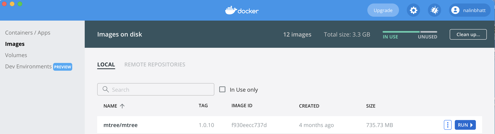
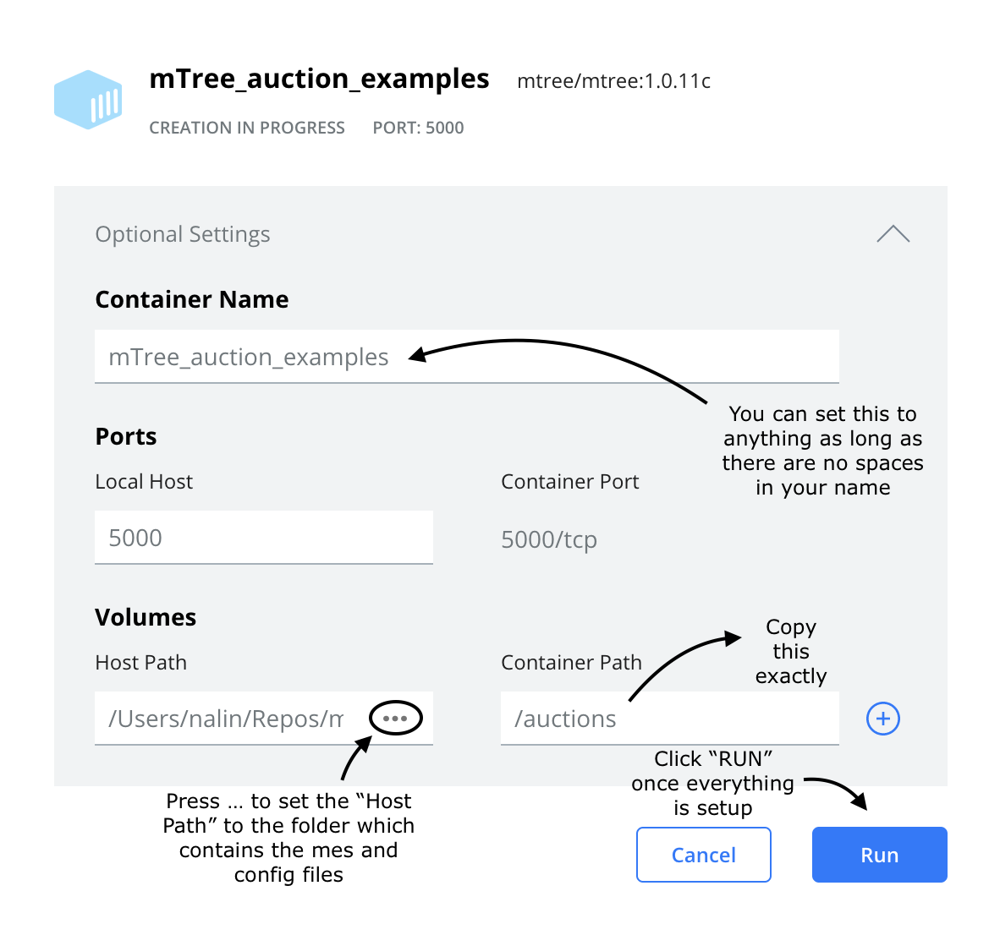
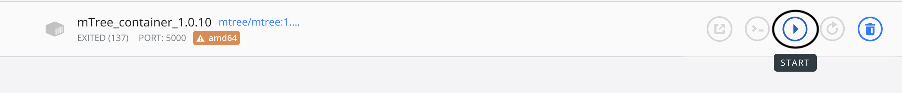

============
Installation
============
.. 
    is mTree a software or a python library ?

In order to run **mTree** we need to install `Docker Desktop <https://www.docker.com>`_  first.  

.. _install-docker-desk:

Installing Docker Desktop
-------------------------

The links for **Docker Desktop** installation for different os can be found below. 

    - `Download Docker Desktop <https://www.docker.com/products/docker-desktop>`_

After completing the **Docker Desktop** installation, we can start installing **mTree**

.. _install-mTree:

Installing mTree
----------------

You can install **mTree** by pasting the following code in your command prompt. 
paste the following in your command prompt, power shell or terminal. You can also check to find
the latest version of **mTree** `here <https://hub.docker.com/r/mtree/mtree/tags>`_

.. code-block:: console

    $ docker pull mtree/mtree:1.0.10

.. note:: 

    The command prompt should be based in the same virtual environment where you
    have **Docker Desktop** installed. 

After pasting and running the command in your command prompt, your screen should look
some version of this - 

.. figure:: _static/terminal.png
        :align: center

.. _mTree-container-setup:

mTree Container Setup
----------------------

Open **Docker Desktop** app on your computer and click
images on the sidebar. 

This is the **mTree** image we just downloaded through docker hub in the previous step. We are going to run this 
image within a small virtualization of the os called a 'container'. We can create our docker 
container by clicking "Run" on the mTree image. 

After that you should see the following window.

Once all the instructions in the image are completed, you should click "Containers"
on the sidebar. After hitting "Containers" you should see the following container -

.. figure:: _static/unstarted_container.png
        :align: center

Click "Start" to start your container. 

A running docker container should have a green symbol on the left side. 

.. figure:: _static/started_container.png
        :align: center

Container Options
^^^^^^^^^^^^^^^^^
Your container comes with several options that can be executed to change its 
state. 

You can stop running your container by pressing "stop" button

.. figure:: _static/stop_button.png
        :align: center

You can restart your container by pressing the "restart" button 

.. figure:: _static/restart_button.png
        :align: center

If you want to delete the image, you can press the "delete" button

.. figure:: _static/delete_button.png
        :align: center

Once your container is running, you should click "CLI" button to open the command prompt
linked to your container. 

.. figure:: _static/shell_button.png
        :align: center

The command prompt produced by Docker should look similar to the following -

.. figure:: _static/container_command_prompt.png
        :align: center

If your Docker shell looks as above, then you have correctly installed **mTree** and you should 
move to the :doc:`quick_start` section to run an example. 

