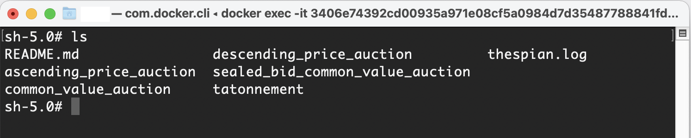
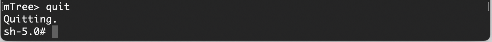

=================
Quick Start Guide
=================

In this **Quick Start Guide**, we are going to run a simple **mTree simulation**
while giving an overview of key components that are necessary for **mTree** to execute 
without error. The goal of this guide is to show you how to run an **mTree simulation** from 
start to finish and point out the vital indicators that convey a simulation has run properly. 

Cloning mTree_auction_examples
==============================

We are going to clone the **mTree_auction_examples** repository, which can
be found `here <https://github.com/gmucsn/mTree_learning_exercises>`_, and run one 
of the examples to make sure **mTree** is running properly. 

Open your command prompt and navigate to an apporpriate place within your file system  
using the ``cd`` command and run the following code. 

.. code-block:: console

    $ git clone https://github.com/gmucsn/mTree_auction_examples.git

This will create an **mTree_auction_examples** folder at your specified 
location.

.. tip:: 
    If you are new to **command line** you can check out the following links on 
    how to navigate your file system -

    | `Terminal for Beginners <https://medium.com/@grace.m.nolan/terminal-for-beginners-e492ba10902a>`_ (Macs) 
    | `A Beginner's Guide to the Windows Command Prompt <https://www.makeuseof.com/tag/a-beginners-guide-to-the-windows-command-line/>`_ (Windows)

    Although, the following resources provide a great background which might be helpful later, nevertheless, 
    for these next few steps, you only need to know how the ``cd`` command works.  

Running mTree_auction_examples 
==============================

In order to run this simulation we need to create a **docker container** using 
the **Docker Desktop** app that we downloaded in  :doc:`installation` section. 

mTree_auction_examples container setup
--------------------------------------

Follow all the steps highlighted in the :ref:`mTree-container-setup` section 
and set the **Host Path** to the **mTree_auction_example folder** (which you cloned in the previous step)

After finishing the setup process, click **Container/Apps** on the sidebar of 
**Docker Desktop**. There should be a container by the name **mTree_auction_examples**
present. 

.. figure:: _static/mTree_auction_examples_comp_setup.png
        :align: center

|

Running mTree_auction_examples container
----------------------------------------

Start the container and open the **shell**. More details on how to do this are 
covered in :ref:`mTree-container-options` under :ref:`mTree-container-start`
and :ref:`mTree-container-cli`. 

Your **shell** should look some version of this - 

.. figure:: _static/mTree_auction_examples_shell.png
        :align: center

| Run the following commands to view the underlying files in the folder.  

| **Mac** 

.. code-block:: console

    $ ls 

| **Windows**

.. code-block:: console

    $ dir

You should see the following subfolders-

|

Tatonnement
-----------

One of the subfolders present should have the name **tatonnement** which refers to 
the famous `Tatonnement <https://en.wikipedia.org/wiki/Walrasian_auction>`_ auction. Further information about the 
auction style and description can be found in the :doc:`learning_paths`.

In your **mTree_auction_examples** container **shell** type in the following command to set 
the current directory to **tatonnement**.

.. code-block:: console
    
    $ cd tatonnement

File Structure
--------------

After setting tatonnement as the current directory, run **ls** or **dir** and 
you should see the following folders. 

1. :ref:`config <config>`
2. :ref:`mes <Actors>`
3. :ref:`logs <logs>`

.. figure:: _static/quick_start_tatonnement_ls.png
        :align: center

|

.. note::
    In order to properly run an **mTree simulation** you need to set the current 
    directory to the folder which contains a **config**, **mes**, and a **logs** folder.
    **mTree** looks for these particular folders to run the simulation. For our example, this is the **tatonnement**
    folder inside **mTree_auction_examples**.

.. tip:: 
    In the future, when designing your own container, you can set the **Host Path**
    directly to the folder containing the **config** and **mes** folder. That way 
    you don't have to navigate to the desired directory within the docker **shell**. 

The :ref:`config` folder (short for configurations) contains your **JSON config files** which are used to instantiate **mTree** :ref:`Actors <Actors>` defined in 
the **mes** folder. 

The **mes** folder (short for Microeconomic System) containes the python files where you define the different
:ref:`Actor <Actors>` classes, namely - the :ref:`environment` , :ref:`institution` and :ref:`agent`. 

.. warning:: 

    It is critical that your **simulation folder** contains a **config** folder, with a **JSON config file** inside,
    and a separate **mes** folder with python files inside, which contain :ref:`environment` , :ref:`institution` and :ref:`agent` code.
    **In the absence of any of these your mTree simulation will not run.**

Inside the **config** folder in the **tatonnement** auction example, you should see a **basic_simulation.json** file. 
This is the config file which we will run. 

For the next step we want to make sure that our current directory is **tatonnement** so if you used the **cd** command to 
change the directory to **config** and view its contents, we want to go up a directory using the following command to make sure 
we are in the right directory. 

.. code-block:: console 

    $ cd .. 

.. _run_config:

Running mTree_auctions_examples simulation
------------------------------------------

We can type the following command into the **shell** to start **mTree**.  

.. code-block:: console 

    $ mTree_runner 

You should see something similar to this.

.. figure:: _static/quick_start_mTree_runner.png
        :align: center

| Enter the following to start the selection process for the config file.

.. code-block:: console 

    $ run_simulation

| Your window should look like this. 

.. figure:: _static/quick_start_run_simulation.png
        :align: center

|

Click **<enter>** to select and run the **basic_simulation.json** file. 
Your output should look something similar to this. 

.. figure:: _static/quick_start_run_config.png
        :align: center

|

What to expect?
---------------

Ideally when a simulation is run, you should setup :ref:`Actors <Actors>` in such a way that 
they constantly :ref:`log <logs>`  their states to :ref:`.log <log_file>`  and  :ref:`.data <data_log>` files. 

logs
^^^^
The **logs** folder, inside your simulation folder (which in our case is **tatonnement**), is where the 
output from your simulation gets stored. You should see a file ending in ``.log`` and a file ending in ``.data``. 

More on how these files are named can be found :ref:`here<log_file>`. 

The first few lines of you ``.log`` file document the config file parameters which were used to run the simulation

.. figure:: _static/quick_start_log_config.png
        :align: center

| The rest of your ``.log`` file should look as follows. 

.. figure:: _static/quick_start_log_rest.png
        :align: center

| Your ``.data``  file should look something like this - 

.. figure:: _static/quick_start_data_log.png
        :align: center

|

.. note:: 

    Don't worry if the log files on your end don't match the ones shown here word for word. Since **mTree** is a 
    concurrent Agent-Based Modelling software, it is common for different :ref:`Actors <Actors>` to log asynchronously to the
    same ``.log`` and ``.data`` files, giving them an out of order look. 
    

How to know your simulation has ended? 
--------------------------------------
(Under development)

Checking for Errors
-------------------

You can use the ``ctrl F`` (Windows) or  ``cmd F`` (Mac) command to search for ``Error`` messages in the ``.log`` file. If there are no results then it is likely 
that your simulation has run properly. If there are instances of ``Error`` messages then check out the :ref:`error` section.

.. warning::

    If you see no results for ``Error`` but your mTree log stops logging in the middle of the simulation, then it is still 
    possible you have logic errors that don't terminate the process. Luckily, you don't have to worry about that in the 
    **tatonnement** auction example.

Quitting
--------

Once the simulation has ended, you can run ``quit`` command in the **docker shell** to kill mTree. The ``quit`` command 
is used to kill all mTree processes as well as **delete** all :ref:`Actor <Actors>` instances previously created to run the simulation. 

.. code-block:: console 

    $ quit

Your console should look like some version of this - 

        
|

Conclusion
----------

Congratulations on successfully running your first mTree simulation! If you want to know how this example was built
or you want to find more projects like this, checkout :ref:`tatonnement` or :doc:`learning_paths` sections. 
If you want to view a more in-depth case which builds an mTree project from scratch, checkout :doc:`quick_build`. 

