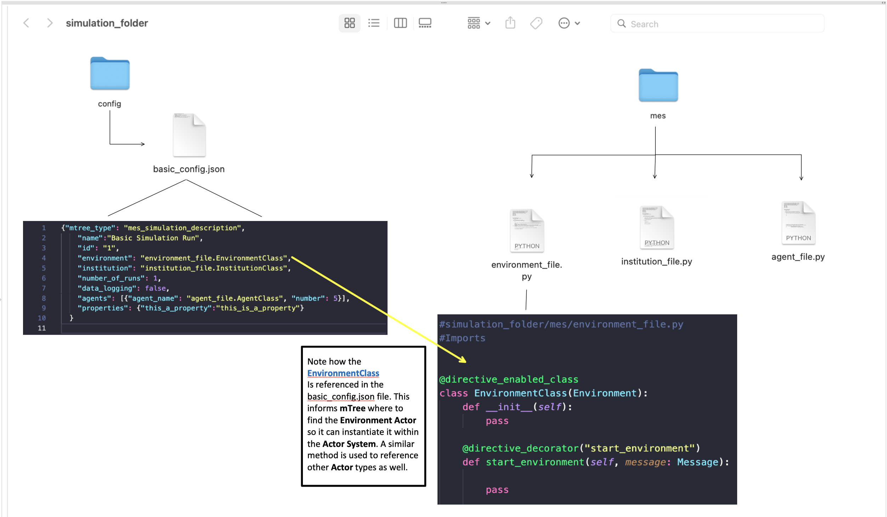

=========
Reference
=========

Several sections are under development...

Theory of Operations
====================

- Contains a description and background of Microeconomic Systems and how mTree allows you to define different actors 
- Goes in depth as to why mTree. 
- Need to define why messages are necessary 

.. _messages: 

messages
========

In the :ref:`Actor<Actors>` system, Actors only have access to their personal states. As a result, 
the only way Actors can change their state is through some constant design or by recieving new 
information from a different Actor. 

In **mTree**, Actors send **messages** using the ``Message`` class which needs to be :ref:`imported <necessary_imports>` at the top 
of each file that includes the code for your **mTree** :ref:`Actor<Actors>`. 

The ``Message`` class is used to create a ``Message`` object, which is then used to send a **message** 
to another Actor. The following code snippet shows how crafting and sending a basic **message** looks like. 
To know more about the neccessary contents of messages check out :ref:`send_message`. 

.. code-block:: python

    new_message = Message() #creates a message object 
    new_message.set_sender(self.myAddress) #self.myAddress is the agent's personal mTree Actor address
    new_message.set_directive("institution_message") #directives are used by message receiving agents to recieve specific messages
    message_payload = "any_python_data_type_would_do"
    new_message.set_payload(message_payload) #you can set the payload to any python data type

    self.send(reciever_address, new_message) # This method is used to finally send your message 

.. _start_environment:

start_environment
-----------------

The ``start_environment`` message is the very first message that gets sent by the **mTree_runner** to the :ref:`environment` Actor (specified in the :ref:`config` file)
after **mTree** initializes everything. 

.. code-block:: python
    
    #inside simulation_folder/mes/environment_file.py

    @directive_enabled_class  
    class EnvironmentClass(Environment):
        def __init__(self):
            pass

        @directive_decorator("start_environment")  
        def start_environment(self, message:Message):
            pass 

.. tip::

    The ``start_environment`` directive can be viewed as the genisis message which gets the ball 
    rolling for all other subsequent messages. Therefore, it is recommended that the directive is 
    used to initialize the environment state as well as send important state information to other Actors. 

.. warning:: 
    
    All mTree simulation need to have a ``start_environment`` :ref:`directive <directive>` specified in 
    the Environment Actor in order to start their simulation. However, messages sent in the ``start_environment`` 
    directive as well as other directives can be based on your design. 

.. _send_message:

How to send a message
---------------------

In order to send a message, the Actor must first receive a message in a :ref:`directive <directive>` first.
Once in a **directive**, the key elements for a message are -

* **Sending Actor's address**: Usually accessed by :code:`self.myAddress` 
* **Content**: This could be any python data type message (None types also work) that you want the other Actor to recieve. 
* **Receiving Actor's address**: This could be accessed several ways, see code example in :ref:`directive <directive>` or checkout :ref:`address_book`

Here is how you can define and send a message-

.. code-block:: python

    new_message = Message() #creates a message object 
    new_message.set_sender(self.myAddress) #self.myAddress is the agent's personal mTree Actor address
    new_message.set_directive("institution_message") #directives are used by message receiving agents to recieve specific messages
    new_message.set_payload("any_python_data_type_would_do") #you can set the payload to any python data type

    self.send(reciever_address, new_message) # This method is used to finally send your message 

|
| In the example below, we continue the ``start_messsage`` directive method in the Environment and send a message 
| to the Institution.
| 

.. code-block:: python

    @directive_enabled_class  
    class EnvironmentClass(Environment):
        def __init__(self):
            pass

        @directive_decorator("start_environment")
        def start_environment(self, message:Message):
            
            your_message = Message() #create a message object 
            your_message.set_sender(self.myAddress) #self.myAddress is the agent's personal mTree Actor address
            your_message.set_directive("institution_message") #directives are used by message receiving agents to recieve specific messages
            your_message.set_payload("any_python_data_type_would_do") #you can set the payload to any python data type
            
            #checkout the <address_book> section in References to find how different Actors access each other's addresses
            receiver_address = self.address_book.select_addresses({"short_name":"institution_file.InstitutionClass 1"}) 
            
            self.send(receiver_address, your_message) # This method is used to finally send your message 
        

.. _directive:

Directives / Receiving Messages
^^^^^^^^^^^^^^^^^^^^^^^^^^^^^^^

**Directives** are special class methods defined in Actor classes (contained in .py files inside your **mes** folder). 
They are used to view messages sent to the Actor. 

| Actors need to have the following in their classes to recieve a particular message. 
|

.. code-block:: python 

    @directive_decorator("directive_name")
    def directive_name(self, message: Message):

        message_payload = message.get_payload() #accesses the message payload 
        message_sender_address = message.get_sender() #access the sender agent's address

.. warning::  

    In order to recieve a messsage your directive name and your method name need to be the same, otherwise, 
    mTree throws the following :ref:`error<directive_error>`.

.. note::
    For the following example our Actor is set as the :ref:`Institution` type, however, the message receiving process is applicable
    for any type. 

| In this example below, the institution receives a message sent by the Environment in :ref:`send message <send_message>`.

.. code-block:: python 

    @directive_enabled_class
    class InstitutionClass(Institution):
        def __init__(self):
            pass

        @directive_decorator("institution_message") 
        def institution_message(self, message:Message):#The method name needs to be the same as the directive name set in quotes above
            
            message_payload = message.get_payload() #accesses the message payload 
            message_sender_address = message.get_sender() #access the sender agent's address
            
            #You can find more on logging in the <logs> section in References 
            self.log_message(f"message_payload = {message_payload}\n"
                            f"message_sender_address = {message_sender_address}\n")

Your :ref:`log<log_message>` file should produce the following output -

.. code-block:: ruby

    1645122024.0900638	message_payload = any_python_data_type_would_do

    1645122024.0937853	message_sender_address = ActorAddr-(T|:43253)

.. _Actors:

Actor Description
=================

Imports
-------

While coding **mTree** Actors, there are several features that mTree provides Actor classes the ability to interact with 
within the Actor world. 

.. _necessary_imports:

Necessary Imports 
^^^^^^^^^^^^^^^^^
Each file that contains the code for your mTree Actors (Environment/Institution/Agent) 
**needs** to have the following imports in order to work properly. 
These imports provide the Actors with a range of capabilities including but not limited to communicating via messages. 

.. code-block:: python 

    from mTree.microeconomic_system.environment import Environment #Parent class for Environment Actors 
    from mTree.microeconomic_system.institution import Institution #Parent class for Institutoin Actors 
    from mTree.microeconomic_system.agent import Agent #Parent class for Agent Actors 
    from mTree.microeconomic_system.directive_decorators import * 
    from mTree.microeconomic_system.message import Message #Message class allows you to create and send messages 
    

Additional Imports
^^^^^^^^^^^^^^^^^^

**mTree** also provides the following additional imports when running **mTree** in a container. 

.. code-block:: python 

    import math
    import random
    import logging
    import time
    import datetime
    import sympy

.. _environment:

Environment
-----------
Here is a code snippet that you can modify to construct your **mTree** ``Environment`` Actor.

.. code-block:: python

    #NOTE: this python file needs to be inside the /mes folder 

    #These imports can also be found in the Imports section above
    from mTree.microeconomic_system.environment import Environment 
    from mTree.microeconomic_system.institution import Institution
    from mTree.microeconomic_system.agent import Agent
    from mTree.microeconomic_system.directive_decorators import *
    from mTree.microeconomic_system.message import Message
    import math
    import random
    import logging
    import time
    import datetime

    #In the config, the class below 
    #should be referenced as  "<.py filename>.EnvironmentClass", 
    #Example -  environment_file.InstitutionClass (assuming the filename is set to environment_file.py)
    @directive_enabled_class  
    class EnvironmentClass(Environment): #you can change the class name to anything, as long as the parent class (Environment) stays same
        def __init__(self):
            pass

        @directive_decorator("start_environment")
        def start_environment(self, message: Message): # The first message sent by mTree_runner, check messages section to find out more

            pass

.. Tip:: 
    
    You can change the class name of the above Actor ``EnvironmnetClass`` to anything as long as 
    the parent class ``Environment`` stays the same. 

.. _institution:

Institution
-----------

Here is a code snippet that you can modify to construct your **mTree** ``Institution`` Actor.

.. code-block:: python 

    #NOTE: this python file needs to be inside the /mes folder 

    #These imports can also be found in the Imports section above
    from mTree.microeconomic_system.environment import Environment
    from mTree.microeconomic_system.institution import Institution
    from mTree.microeconomic_system.agent import Agent
    from mTree.microeconomic_system.directive_decorators import *
    from mTree.microeconomic_system.message import Message
    import math
    import random
    import logging
    import time
    import datetime

    #In the config, the class below 
    #should be referenced as  "<.py filename>.InstitutionClass", 
    #Example -  institution_file.InstitutionClass (assuming the filename is set to institution_file.py)
    @directive_enabled_class
    class InstitutionClass(Institution): #you can change the class name to anything, as long as the parent class (Institution) stays same
        def __init__(self):
            pass
    

.. Tip:: 
    
    You can change the class name of the above Actor ``InstitutionClass`` to anything as long as 
    the parent class ``Institution`` stays the same. 

.. _agent:

Agent 
-----

Here is a code snippet that you can modify to construct your **mTree** ``Agent`` Actor. 

.. code-block:: python

    #NOTE: this python file needs to be inside the /mes folder 

    #These imports can also be found in the Imports section above
    from mTree.microeconomic_system.environment import Environment
    from mTree.microeconomic_system.institution import Institution
    from mTree.microeconomic_system.agent import Agent
    from mTree.microeconomic_system.directive_decorators import *
    from mTree.microeconomic_system.message import Message
    import math
    import random
    import logging
    import time
    import datetime

    #In the config, the class below 
    #should be referenced as "<.py filename>.AgentClass" , 
    #Example -  "institution_file.InstitutionClass" (assuming the filename is set to institution_file.py)
    @directive_enabled_class
    class AgentClass(Agent):  #you can change the class name to anything, as long as the parent class (Agent) stays same
        def __init__(self):
            pass

.. Tip:: 
    
    You can change the class name of the above Actor ``AgentClass`` to anything as long as 
    the parent class ``Agent`` stays the same. 

.. _config:

config folder
=============

There needs to be a  **config** folder inside each **mTree simulation folder**. Within the **config** folder there needs to 
be a **.json** file that contains your simulation configurations. Although, the name of the **config** folder cannot be changed, nevertheless, 
your **.json** config file, can have any name.

config file 
-----------

Your config file is a **.json** file containing a **json dictionary**. Inside this **json dictionary** we define the
key parameters that **mTree** uses to instantiate the various :ref:`Actors<Actors>` as well as any simulation specific
variables that our Actors might need.

.. code-block:: json

    {"mtree_type": "mes_simulation_description",
    "name":"Basic Simulation Run",
    "id": "1",
    "environment": "environment_file.EnvironmentClass",
    "institution": "institution_file.InstitutionClass",
    "number_of_runs": 1,
    "data_logging": false, 
    "agents": [{"agent_name": "agent_file.AgentClass", "number": 5}],
    "properties": {"this_a_property":"this_is_a_property"}
    }

mTree use 
^^^^^^^^^

.. code-block:: json 

    {"mtree_type": "mes_simulation_description", 
     "name": "any name should do",
     "id": "1" 
     }

Although, the first three keys are used by **mTree** on a systemic level, however, even if you don't include 
the three keys, **mTree** assigns default values for them. More importantly, it is still highly recommended that you
pass some values for them, even the ones suggested above. 

Referencing different actors 
^^^^^^^^^^^^^^^^^^^^^^^^^^^^
Within the **config file** we inform **mTree** which code we want to use to spawn Actors. 

    The figure shows how an Environmnet Actor(EnvironmentClass) is referenced within a config file. 

Environment
***********

.. code-block:: json 

    {"mtree_type": "mes_simulation_description",
     "name": "Basic Simulation", 
     "id": "1" ,
     "environment": "environment_file.EnvironmentClass" }

After selecting and running a **config file**, the **mTree_runner** looks for the **Environment Actor** code 
inside the **mes** folder. The value of the ``"environment"`` key - "environment_file.EnvironmentClass" informs **mTree** 
to spawn the **Environment Actor** using the *EnvironmentClass* class present inside the *environment_file.py* file, which 
in turn should be located inside the **mes** folder. 

.. Note:: 
    Unlike **Institutions** and **agents**, **mTree** only allows for a single **Environment** per simulation.
    Also, each simulation **needs** to have an **Environment Actor** because the very first message that gets 
    sent by the system is the ``start_environment`` message.

Institution
***********

**Single Instance**

.. code-block:: json 

    {"mtree_type": "mes_simulation_description",
     "name": "Basic Simulation", 
     "id": "1" ,
     "environment": "environment_file.EnvironmentClass",
     "institution": "institutin_file.InstitutionClass" 
     }

After selecting and running a **config file**, the **mTree_runner** looks for the **Institution Actor(s)** code 
inside the **mes** folder. The value of the ``"institution"`` key - "institution_file.InstitutionClass" informs **mTree** 
to spawn the **Institution Actor(s)** using the *InstitutionClass* class present inside the *institution_file.py* file 
inside the **mes** folder. 

**Multiple Instances** 

.. code-block:: json

    {"mtree_type": "mes_simulation_description",
     "name": "Basic Simulation", 
     "id": "1" ,
     "environment": "environment_file.EnvironmentClass", 
     "institutions": [{"institution": "institution_file.InstitutionClass", "number": 2}]
     }

For multiple instances of the same **InstitutionClass** Actor we use the above format where 
the key changes from ``"institution"`` to ``"institutions"``, and the corresponding value is a list of 
dictionaries. Within the institution dictionary, the value of the ``"institution"`` key specifies 
where the **Institution Actor** code is and the value of the ``"number"`` key specifies - how many to spawn. 

To sum it all up, the above code should create 2 Institution Actors using the same code present 
inside mes/institution_file.py with the class name - InstitutionClass.

**Multiple Institutions** 

.. code-block:: json

    {"mtree_type": "mes_simulation_description",
     "name": "Basic Simulation", 
     "id": "1" ,
     "environment": "environment_file.EnvironmentClass",
     "institutions": [{"institution": "institution_file.InstitutionClass", "number": 1}, 
                     {"institution": "institution_file.DifferentInstitutionClass", "number": 1}]
    }

Notice that the ``"institutions"`` key has a list as its corresponding value. Inside this list, 
you can insert the different types of **Institution Actor** you want to create as separate dictionaries. 
This is useful if you have two separate coded institution classes that serve different roles 
in your microeconomic system.

You can also control the number of instances of each particular **Institution Actor** using the 
``"number"`` key. 

Agents
******

The reference for **Agents** works exactly like references for **Institutions**. 

**Single Instances** 

.. code-block:: json 

    {"mtree_type": "mes_simulation_description",
     "name": "Basic Simulation", 
     "id": "1" ,
     "environment": "environment_file.EnvironmentClass",
     "institution": "institutin_file.InstitutionClass", 
     "agent": "agent_file.AgentClass"
     }

After selecting and running a **config file**, the **mTree_runner** looks for the **Agent Actor(s)** code 
inside the **mes** folder. The value of the ``"agent"`` key - "agent_file.AgentClass" informs **mTree** 
to spawn the **Agent Actor(s)** using the *AgentClass* class present inside the *agent_file.py* file 
inside the **mes** folder. 

**Multiple Instances** 

.. code-block:: json

    {"mtree_type": "mes_simulation_description",
     "name": "Basic Simulation", 
     "id": "1" ,
     "environment": "environment_file.EnvironmentClass", 
     "institution": "institutin_file.InstitutionClass", 
     "agents": [{"agent": "agent_file.AgentClass", "number": 2}]
     }

For multiple instances of the same **AgentClass** Actor we use the above format where 
the key changes from ``"agent"`` to ``"agents"``, and the corresponding value is a list of 
dictionaries. Within the agent dictionary, the value of the ``"agent"`` key specifies 
where the **Agent Actor** code is and the value of the ``"number"`` key specifies - how many to spawn. 

To sum it all up, the above code should create 2 Agent Actors using the same code present 
inside mes/agent_file.py with the class name - AgentClass.

**Multiple Agents** 

.. code-block:: json

    {"mtree_type": "mes_simulation_description",
     "name": "Basic Simulation", 
     "id": "1" ,
     "environment": "environment_file.EnvironmentClass",
     "institution": "institutin_file.InstitutionClass", 
     "agents": [{"agent": "agent_file.AgentClass", "number": 1}, 
                     {"agent": "agent_file.DifferentAgentClass", "number": 1}]
    }

Notice that the ``"agents"`` key has a list as its corresponding value. Inside this list, 
you can insert the different types of **Agent Actor** you want to create as separate dictionaries. 
This is useful if you have two separate coded agent classes that serve different roles 
in your microeconomic system.

You can also control the number of instances of each particular **Agent Actor** using the 
``"number"`` key. 

Simulation Properties
^^^^^^^^^^^^^^^^^^^^^

Users are allowed to specify additional information that may be simulation specific and can be used to 
initialize different agent types, distribute endowments, and much more. Check out one of the :doc:`quick_build`, 
how properties are being used to 
  
running multiple
----------------

.. _address_book:

address book 
============

The **address_book** is an **mTree** object that stores addresses of all the Actors that are initialized in the :ref:`config` file.
Access to it is limited to the :ref:`Environment` Actor at first, nevertheless, access can be controlled and passed on to different agents

Methods 
-------

.. code:: python 

    self.address_book.get_agents()

.. _logs:

Logs
====

Logging is a way to output key data from a simulation in order to keep track of what the code is doing at various steps. 
mTree provides 2 types of logging capabilities.

- Desription of the 2 types of logging capability that mTree provides 

.. _log_file:

Log File
--------

.. _log_message:

self.log_message(input)
^^^^^^^^^^^^^^^^^^^^^^^

Example 
^^^^^^^
- Shows what a sample log output looks like 
- What all can the log message log.

Best Practice Suggestion
^^^^^^^^^^^^^^^^^^^^^^^^
- Include entry and exit logs. Log variable when certiain important state changes happen. 

.. _data_log:

Data Log 
--------

.. _log_data:

self.log_data(input)

Example
^^^^^^^
- Shows sample output from the .data file 

Interpret into Jupyter notebook
^^^^^^^^^^^^^^^^^^^^^^^^^^^^^^^
Simple suggestions on how to log data using dictionaries and little code on how pandas could 
be used to read the dataframe. 

.. _error:

Error Handling
==============

.. _directive_error:

Directive name error
--------------------

.. _sim_state:

mTree Simulation State 
======================

