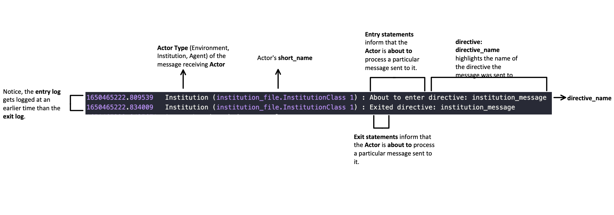

=========
Reference
=========

Several sections are under development...

Theory of Operations
====================

- Contains a description and background of Microeconomic Systems and how mTree allows you to define different actors 
- Goes in depth as to why mTree. 
- Need to define why messages are necessary 

.. _messages: 

messages
========

In the :ref:`Actor<Actors>` system, Actors only have access to their personal states. As a result, 
the only way Actors can change their state is through some constant design or by recieving new 
information from a different Actor. 

In **mTree**, Actors send **messages** using the ``Message`` class which needs to be :ref:`imported <necessary_imports>` at the top 
of each file that includes the code for your **mTree** :ref:`Actor<Actors>`. 

The ``Message`` class is used to create a ``Message`` object, which is then used to send a **message** 
to another Actor. The following code snippet shows how crafting and sending a basic **message** looks like. 
To know more about the neccessary contents of messages check out :ref:`send_message`. 

.. code-block:: python

    new_message = Message() #creates a message object 
    new_message.set_sender(self.myAddress) #self.myAddress is the agent's personal mTree Actor address
    new_message.set_directive("institution_message") #directives are used by message receiving agents to recieve specific messages
    message_payload = "any_python_data_type_would_do"
    new_message.set_payload(message_payload) #you can set the payload to any python data type

    self.send(reciever_address, new_message) # This method is used to finally send your message 

.. _start_environment:

start_environment
-----------------

The ``start_environment`` message is the very first message that gets sent by the **mTree_runner** to the :ref:`environment` Actor (specified in the :ref:`config` file)
after **mTree** initializes everything. 

.. code-block:: python
    
    #inside simulation_folder/mes/environment_file.py

    @directive_enabled_class  
    class EnvironmentClass(Environment):
        def __init__(self):
            pass

        @directive_decorator("start_environment")  
        def start_environment(self, message:Message):
            pass 

.. tip::

    The ``start_environment`` directive can be viewed as the genisis message which gets the ball 
    rolling for all other subsequent messages. Therefore, it is recommended that the directive is 
    used to initialize the environment state as well as send important state information to other Actors. 

.. warning:: 
    
    All mTree simulation need to have a ``start_environment`` :ref:`directive <directive>` specified in 
    the Environment Actor in order to start their simulation. However, messages sent in the ``start_environment`` 
    directive as well as other directives can be based on your design. 

.. _send_message:

How to send a message
---------------------

In order to send a message, the Actor must first receive a message in a :ref:`directive <directive>` first.
Once in a **directive**, the key elements for a message are -

* **Sending Actor's address**: Usually accessed by :code:`self.myAddress` 
* **Content**: This could be any python data type message (None types also work) that you want the other Actor to recieve. 
* **Receiving Actor's address**: This could be accessed several ways, see code example in :ref:`directive <directive>` or checkout :ref:`address_book`

Here is how you can define and send a message-

.. code-block:: python

    new_message = Message() #creates a message object 
    new_message.set_sender(self.myAddress) #self.myAddress is the agent's personal mTree Actor address
    new_message.set_directive("institution_message") #directives are used by message receiving agents to recieve specific messages
    new_message.set_payload("any_python_data_type_would_do") #you can set the payload to any python data type

    self.send(reciever_address, new_message) # This method is used to finally send your message 

|
| In the example below, we continue the ``start_messsage`` directive method in the Environment and send a message 
| to the Institution.
| 

.. code-block:: python

    @directive_enabled_class  
    class EnvironmentClass(Environment):
        def __init__(self):
            pass

        @directive_decorator("start_environment")
        def start_environment(self, message:Message):
            
            your_message = Message() #create a message object 
            your_message.set_sender(self.myAddress) #self.myAddress is the agent's personal mTree Actor address
            your_message.set_directive("institution_message") #directives are used by message receiving agents to recieve specific messages
            your_message.set_payload("any_python_data_type_would_do") #you can set the payload to any python data type
            
            #checkout the <address_book> section in References to find how different Actors access each other's addresses
            receiver_address = self.address_book.select_addresses({"short_name":"institution_file.InstitutionClass 1"}) 
            
            self.send(receiver_address, your_message) # This method is used to finally send your message 
        

.. _directive:

Directives / Receiving Messages
^^^^^^^^^^^^^^^^^^^^^^^^^^^^^^^

**Directives** are special class methods defined in Actor classes (contained in .py files inside your **mes** folder). 
They are used to view messages sent to the Actor. 

| Actors need to have the following in their classes to recieve a particular message. 
|

.. code-block:: python 

    @directive_decorator("directive_name")
    def directive_name(self, message: Message):

        message_payload = message.get_payload() #accesses the message payload 
        message_sender_address = message.get_sender() #access the sender agent's address

.. warning::  

    In order to recieve a messsage your directive name and your method name need to be the same, otherwise, 
    mTree throws the following :ref:`error<directive_error>`.

.. note::
    For the following example our Actor is set as the :ref:`Institution` type, however, the message receiving process is applicable
    for any type. 

| In this example below, the institution receives a message sent by the Environment in :ref:`send message <send_message>`.

.. code-block:: python 

    @directive_enabled_class
    class InstitutionClass(Institution):
        def __init__(self):
            pass

        @directive_decorator("institution_message") 
        def institution_message(self, message:Message):#The method name needs to be the same as the directive name set in quotes above
            
            message_payload = message.get_payload() #accesses the message payload 
            message_sender_address = message.get_sender() #access the sender agent's address
            
            #You can find more on logging in the <logs> section in References 
            self.log_message(f"message_payload = {message_payload}\n"
                            f"message_sender_address = {message_sender_address}\n")

Your :ref:`log<log_message>` file should produce the following output -

.. code-block:: ruby

    1645122024.0900638	message_payload = any_python_data_type_would_do

    1645122024.0937853	message_sender_address = ActorAddr-(T|:43253)

.. _Actors:

Actor Description
=================

Imports
-------

While coding **mTree** Actors, there are several features that **mTree** provides Actor classes the ability to interact with 
within the Actor world. 

.. _necessary_imports:

Necessary Imports 
-----------------
Each file that contains the code for your mTree Actors (Environment/Institution/Agent) 
**needs** to have the following imports in order to work properly. 
These imports provide the Actors with a range of capabilities including but not limited to communicating via messages. 

.. code-block:: python 

    from mTree.microeconomic_system.environment import Environment #Parent class for Environment Actors 
    from mTree.microeconomic_system.institution import Institution #Parent class for Institutoin Actors 
    from mTree.microeconomic_system.agent import Agent #Parent class for Agent Actors 
    from mTree.microeconomic_system.directive_decorators import * 
    from mTree.microeconomic_system.message import Message #Message class allows you to create and send messages
    import logging #Allows you to log messages to log files
    

Additional Imports
------------------

**mTree** also provides the following additional imports when running **mTree** in a container. 

.. code-block:: python 

    import math
    import random
    
    import time
    import datetime
    import sympy

General Methods and Capabilities (better name under way)
--------------------------------------------------------

Each Actor comes with a general set of capabilities, often represented in the form of class variables and methods 
available to the Actor. On top of that, there are Actor specific class variables and methods that **mTree** reserves 
for the **Environment Actor**, which might not be available to **Institution** and **Agent Actors**. Some of these methods 
have individual sections such as **Message Sending**, **address_boook**, and **logging**, however, some Actor specific methods
have been listed under the different Actor sections. 

The four main capabilities have been listed below - 

1. :ref:`Message Sending<messages>`- covers how and what Actors can send to each other
2. :ref:`Address Book<address_book>`- covers how to keep track of other Actor's address(without which you can't send messages)
3. :ref:`Logging<Logs>`- covers how to output interactions taking place inside a simulation 
4. :ref:`short_name<short_name>`- unique identifier of the Actor, used to navigate the **address_book** and keep track of Actors.

.. _short_name: 

short_name
----------
The **short_name** is a simple unique identifier created by **mTree** for each Actor within the system. The **short_name** 
can be used for identifying which Actor :ref:`logged the data<log_data>` as well as for navigating the :ref:`address_book<address_book_structure>`.

.. Note:: 
    **short_name** was created to distinguish between multiple instances of the same **Actor Class** (an example of 
    an Actor Class can be **InstitutionClass** from the message sending example above). Therefore, 
    currently ``self.short_name`` is not accessible to the **Environment Actor** because there can only be one
    and doesn't need distinguising. However, newer versions of **mTree** plan on instilling **short_name** identifier in all 
    Actors for uniformity purposes. 

The Actors can access their individual **short_name** the following way - 

.. code-block:: python 

    self.short_name #since it is a class variable, it can be called anywhere in the Actor class

if we use the :ref:`log_message` method to log this variable we should observe the following output - 

.. code-block:: python 

    self.log_message(self.short_name) #more about this method can be found in the log_message section

**Output**

    If you log the ``self.short_name`` in an *Agent Actor* you would can see any one of the following 
    outputs. 

.. figure:: _static/reference_short_name_institution.png
    :align: center 

    If you log the ``self.short_name`` in an *Institution Actor* you would can see any one of the following 
    outputs. 

The **short_name** can identify where the Actor code is located in the **mes** folder, which **Actor Class** within
that file was used to create the Actor, and, finally, which instance of the **Actor Class** is the current Actor. 
The last part is useful because there can be multiple instances of the same **Actor Class** and the **short_name** allows 
use to differentiate among them. 

.. _environment:

Environment
-----------
Here is a code snippet that you can modify to construct your **mTree** ``Environment`` Actor.

.. code-block:: python

    #NOTE: this python file needs to be inside the /mes folder 

    #These imports can also be found in the Imports section above
    from mTree.microeconomic_system.environment import Environment 
    from mTree.microeconomic_system.institution import Institution
    from mTree.microeconomic_system.agent import Agent
    from mTree.microeconomic_system.directive_decorators import *
    from mTree.microeconomic_system.message import Message
    import math
    import random
    import logging
    import time
    import datetime

    #In the config, the class below 
    #should be referenced as  "<.py filename>.EnvironmentClass", 
    #Example -  environment_file.InstitutionClass (assuming the filename is set to environment_file.py)
    @directive_enabled_class  
    class EnvironmentClass(Environment): #you can change the class name to anything, as long as the parent class (Environment) stays same
        def __init__(self):
            pass

        @directive_decorator("start_environment")
        def start_environment(self, message: Message): # The first message sent by mTree_runner, check messages section to find out more

            pass

.. Tip:: 
    
    You can change the class name of the above Actor ``EnvironmnetClass`` to anything as long as 
    the parent class ``Environment`` stays the same. 

.. _institution:

Institution
-----------

Here is a code snippet that you can modify to construct your **mTree** ``Institution`` Actor.

.. code-block:: python 

    #NOTE: this python file needs to be inside the /mes folder 

    #These imports can also be found in the Imports section above
    from mTree.microeconomic_system.environment import Environment
    from mTree.microeconomic_system.institution import Institution
    from mTree.microeconomic_system.agent import Agent
    from mTree.microeconomic_system.directive_decorators import *
    from mTree.microeconomic_system.message import Message
    import math
    import random
    import logging
    import time
    import datetime

    #In the config, the class below 
    #should be referenced as  "<.py filename>.InstitutionClass", 
    #Example -  institution_file.InstitutionClass (assuming the filename is set to institution_file.py)
    @directive_enabled_class
    class InstitutionClass(Institution): #you can change the class name to anything, as long as the parent class (Institution) stays same
        def __init__(self):
            pass
    

.. Tip:: 
    
    You can change the class name of the above Actor ``InstitutionClass`` to anything as long as 
    the parent class ``Institution`` stays the same. 

.. _agent:

Agent 
-----

Here is a code snippet that you can modify to construct your **mTree** ``Agent`` Actor. 

.. code-block:: python

    #NOTE: this python file needs to be inside the /mes folder 

    #These imports can also be found in the Imports section above
    from mTree.microeconomic_system.environment import Environment
    from mTree.microeconomic_system.institution import Institution
    from mTree.microeconomic_system.agent import Agent
    from mTree.microeconomic_system.directive_decorators import *
    from mTree.microeconomic_system.message import Message
    import math
    import random
    import logging
    import time
    import datetime

    #In the config, the class below 
    #should be referenced as "<.py filename>.AgentClass" , 
    #Example -  "institution_file.InstitutionClass" (assuming the filename is set to institution_file.py)
    @directive_enabled_class
    class AgentClass(Agent):  #you can change the class name to anything, as long as the parent class (Agent) stays same
        def __init__(self):
            pass

.. Tip:: 
    
    You can change the class name of the above Actor ``AgentClass`` to anything as long as 
    the parent class ``Agent`` stays the same. 

.. _config:

config folder
=============

There needs to be a  **config** folder inside each **mTree simulation folder**. Within the **config** folder there needs to 
be a **.json** file that contains your simulation configurations. Although, the name of the **config** folder cannot be changed, nevertheless, 
your **.json** config file, can have any name.

.. _config_file:

config file 
-----------

Your config file is a **.json** file containing a **json dictionary**. Inside this **json dictionary** we define the
key parameters that **mTree** uses to instantiate the various :ref:`Actors<Actors>` as well as any simulation specific
variables that our Actors might need.

.. code-block:: python

    {"mtree_type": "mes_simulation_description",
    "name":"Basic Simulation Run",
    "id": "1",
    "environment": "environment_file.EnvironmentClass",
    "institution": "institution_file.InstitutionClass",
    "number_of_runs": 1,
    "data_logging": "json", 
    "agents": [{"agent_name": "agent_file.AgentClass", "number": 5}],
    "properties": {"this_a_property":"this_is_a_property"}
    }

mTree use 
^^^^^^^^^

.. code-block:: python

    {"mtree_type": "mes_simulation_description", 
     "name": "any name should do",
     "id": "1" 
     }

Although, the first three keys are used by **mTree** on a systemic level, however, even if you don't include 
the three keys, **mTree** assigns default values for them. More importantly, it is still highly recommended that you
pass some values for them, even the ones suggested above. 

Referencing different actors 
^^^^^^^^^^^^^^^^^^^^^^^^^^^^
Within the **config file** we inform **mTree** which code we want to use to spawn Actors. 

.. figure:: _static/reference_config_referencing.png
    :align: center

    The figure shows how an Environmnet Actor(EnvironmentClass) is referenced within a config file. 

Environment
***********

.. code-block:: json 

    {"mtree_type": "mes_simulation_description",
     "name": "Basic Simulation", 
     "id": "1" ,
     "environment": "environment_file.EnvironmentClass" }

After selecting and running a **config file**, the **mTree_runner** looks for the **Environment Actor** code 
inside the **mes** folder. The value of the ``"environment"`` key - "environment_file.EnvironmentClass" informs **mTree** 
to spawn the **Environment Actor** using the *EnvironmentClass* class present inside the *environment_file.py* file, which 
in turn should be located inside the **mes** folder. 

.. Note:: 
    Unlike **Institutions** and **agents**, **mTree** only allows for a single **Environment** per simulation.
    Also, each simulation **needs** to have an **Environment Actor** because the very first message that gets 
    sent by the system is the ``start_environment`` message.

Institution
***********

**Single Instance**

.. code-block:: json 

    {"mtree_type": "mes_simulation_description",
     "name": "Basic Simulation", 
     "id": "1" ,
     "environment": "environment_file.EnvironmentClass",
     "institution": "institutin_file.InstitutionClass" 
     }

After selecting and running a **config file**, the **mTree_runner** looks for the **Institution Actor(s)** code 
inside the **mes** folder. The value of the ``"institution"`` key - "institution_file.InstitutionClass" informs **mTree** 
to spawn the **Institution Actor(s)** using the *InstitutionClass* class present inside the *institution_file.py* file 
inside the **mes** folder. 

**Multiple Instances** 

.. code-block:: json

    {"mtree_type": "mes_simulation_description",
     "name": "Basic Simulation", 
     "id": "1" ,
     "environment": "environment_file.EnvironmentClass", 
     "institutions": [{"institution": "institution_file.InstitutionClass", "number": 2}]
     }

For multiple instances of the same **InstitutionClass** Actor we use the above format where 
the key changes from ``"institution"`` to ``"institutions"``, and the corresponding value is a list of 
dictionaries. Within the institution dictionary, the value of the ``"institution"`` key specifies 
where the **Institution Actor** code is and the value of the ``"number"`` key specifies - how many to spawn. 

To sum it all up, the above code should create 2 Institution Actors using the same code present 
inside mes/institution_file.py with the class name - InstitutionClass.

**Multiple Institutions** 

.. code-block:: json

    {"mtree_type": "mes_simulation_description",
     "name": "Basic Simulation", 
     "id": "1" ,
     "environment": "environment_file.EnvironmentClass",
     "institutions": [{"institution": "institution_file.InstitutionClass", "number": 1}, 
                     {"institution": "institution_file.DifferentInstitutionClass", "number": 1}]
    }

Notice that the ``"institutions"`` key has a list as its corresponding value. Inside this list, 
you can insert the different types of **Institution Actor** you want to create as separate dictionaries. 
This is useful if you have two separate coded institution classes that serve different roles 
in your microeconomic system.

You can also control the number of instances of each particular **Institution Actor** using the 
``"number"`` key. 

Agents
******

The reference for **Agents** works exactly like references for **Institutions**. 

**Single Instances** 

.. code-block:: json 

    {"mtree_type": "mes_simulation_description",
     "name": "Basic Simulation", 
     "id": "1" ,
     "environment": "environment_file.EnvironmentClass",
     "institution": "institutin_file.InstitutionClass", 
     "agent": "agent_file.AgentClass"
     }

After selecting and running a **config file**, the **mTree_runner** looks for the **Agent Actor(s)** code 
inside the **mes** folder. The value of the ``"agent"`` key - "agent_file.AgentClass" informs **mTree** 
to spawn the **Agent Actor(s)** using the *AgentClass* class present inside the *agent_file.py* file 
inside the **mes** folder. 

**Multiple Instances** 

.. code-block:: json

    {"mtree_type": "mes_simulation_description",
     "name": "Basic Simulation", 
     "id": "1" ,
     "environment": "environment_file.EnvironmentClass", 
     "institution": "institutin_file.InstitutionClass", 
     "agents": [{"agent": "agent_file.AgentClass", "number": 2}]
     }

For multiple instances of the same **AgentClass** Actor we use the above format where 
the key changes from ``"agent"`` to ``"agents"``, and the corresponding value is a list of 
dictionaries. Within the agent dictionary, the value of the ``"agent"`` key specifies 
where the **Agent Actor** code is and the value of the ``"number"`` key specifies - how many to spawn. 

To sum it all up, the above code should create 2 Agent Actors using the same code present 
inside mes/agent_file.py with the class name - AgentClass.

**Multiple Agents** 

.. code-block:: json

    {"mtree_type": "mes_simulation_description",
     "name": "Basic Simulation", 
     "id": "1" ,
     "environment": "environment_file.EnvironmentClass",
     "institution": "institutin_file.InstitutionClass", 
     "agents": [{"agent": "agent_file.AgentClass", "number": 1}, 
                     {"agent": "agent_file.DifferentAgentClass", "number": 1}]
    }

Notice that the ``"agents"`` key has a list as its corresponding value. Inside this list, 
you can insert the different types of **Agent Actor** you want to create as separate dictionaries. 
This is useful if you have two separate coded agent classes that serve different roles 
in your microeconomic system.

You can also control the number of instances of each particular **Agent Actor** using the 
``"number"`` key. 

Simulation Properties/ self.get_properties()
^^^^^^^^^^^^^^^^^^^^^^^^^^^^^^^^^^^^^^^^^^^^

Users are allowed to specify additional information to the ``"properties"`` dictionary. This dictionary is 
reserved for including information that is simulation specific and can be used to initialize different
agent types, initialize different institutions, and much more. Check out one of the :doc:`learning_paths`
to view how properties can be used to prevent hard coding Actors. 

.. code-block:: json

    {"mtree_type": "mes_simulation_description",
     "name": "Basic Simulation", 
     "id": "1" ,
     "environment": "environment_file.EnvironmentClass",
     "institution": "institutin_file.InstitutionClass", 
     "agents": [{"agent": "agent_file.AgentClass", "number": 1}, 
                     {"agent": "agent_file.DifferentAgentClass", "number": 1}],
     "properties": {"agent_types": ["buyer", "seller"],
                    "agent_endowment": 30,
                    "institution_type": ["sealed_bid_auction", "common_value"]
                      }
    }

Accessing Properties
********************

Information mentioned in the ``"properties"`` dictionary can be accessed by the **Environment** Actor using 
the following code. 

.. code-block:: python

    self.get_properties() # this should return the entire properties dictionary. 

**Example** 

If we wanted to access the properties mentioned above, we could use the following code. 

.. code-block:: python 

    agent_type_list = self.get_properties()["agent_types"] #list, accessing the different agent types in the system
    agent_endowment = self.get_properties()['agent_endowment'] #int, accesing the agent endowment 
    institution_type_list = self.get_properties()['institution_type'] #list, institution_type_list 

.. Note:: 

    Only the **Environment** Actor has access to the ``self.get_properties()`` method and can choose to pass relevant 
    information (defined in the config) regarding the an Actor's initial states to them. 

.. _address_book:

address book 
============

The **address_book** is an **mTree** object that stores and manages addresses of all the Actors 
that are initialized in the :ref:`config` file. Each Actor in the system has an **address_book** object 
instantiated when they are spawned. However, at the beginning, only the :ref:`Environment` Actor's **address_book**
has the complete list of Actor addresses in the system. 

The **Environment Actor** can then choose to pass the addresses to different **Institution** and **Agent** Actors 
across the system. We have listed below the different methods that this **address_book** object has and how to 
access them. 

.. _access_address_book:

How to access the address_book 
------------------------------

The **address_book** object can be accessed by the Actors in the following ways 

.. code-block:: python 
    
    self.address_book()

``self.address_book`` is a class variable that gets set by **mTree** for each Actor prior to 
sending the :ref:`start_environment` directive message and points to the Actor's own **address_book** object. 
Since ``self.address_book`` is a class variable, it can be accessed everywhere.

.. _address_book_structure:

Structure
---------
Below we evaluate one of the key **address_book** methods and explore how addresses are stored.

.. code-block:: python 

    all_addresses = self.address_book.get_addresses() #This code should return a dictionary of the following format
    self.log_message(all_addresses) #since mTree suppresses print statements, logging is the only way to get info out

    

.. code-block:: python 

    #The above message should output the following dictionary
    #Notice all the keys are the different actor's short_names and the value of each
    #key is another dictionary containing other important distinguishing information about the Actor
    	{'institution_file.InstitutionClass 1': {'address_type': 'institution', #The Actor's type 
                                                'address': <thespian.actors.ActorAddress object at 0x401aff5c70>, #The Actor's address
                                                'component_class': 'institution_file.InstitutionClass', #Where the code for ActorClass is located 
                                                'component_number': 1, #instance number of the Actor 
                                                'short_name': 'institution_file.InstitutionClass 1'}, #Actor short_name
        'agent_file.AgentClass 1': {'address_type': 'agent', 
                                    'address': <thespian.actors.ActorAddress object at 0x401b0002e0>, 
                                    'component_class': 'agent_file.AgentClass', 
                                    'component_number': 1, 
                                    'short_name': 'agent_file.AgentClass 1'}, 
        'agent_file.AgentClass 2': {'address_type': 'agent', 
                                    'address': <thespian.actors.ActorAddress object at 0x401b000460>, 
                                    'component_class': 'agent_file.AgentClass', 
                                    'component_number': 2, 
                                    'short_name': 'agent_file.AgentClass 2'},
        'agent_file.AgentClass 3': {'address_type': 'agent', 
                                    'address': <thespian.actors.ActorAddress object at 0x401b0004f0>, 
                                    'component_class': 'agent_file.AgentClass', 
                                    'component_number': 3, 
                                    'short_name': 'agent_file.AgentClass 3'}, 
        'agent_file.AgentClass 4': {'address_type': 'agent', 
                                    'address': <thespian.actors.ActorAddress object at 0x401b000580>,
                                    'component_class': 'agent_file.AgentClass', 
                                    'component_number': 4, 
                                    'short_name': 'agent_file.AgentClass 4'}, 
        'agent_file.AgentClass 5': {'address_type': 'agent', 
                                    'address': <thespian.actors.ActorAddress object at 0x401b000610>, 
                                    'component_class': 'agent_file.AgentClass', 
                                    'component_number': 5, 
                                    'short_name': 'agent_file.AgentClass 5'}
                                    }

We are going to evaluate a single entry in this **address_book** dictionary and explore what each information 
means in the figure below. 

.. figure:: _static/reference_address_book_dict.png
    :align: center

    More about **short_name** can be found in the :ref:`short_name` section. 

.. Note:: 
    For the rest of the **address_book** section, we will refer to keys in the dictionary 
    above as **entries** and their corresponding value, which is another dictionary, as the 
    **description dictionary**.

.. Warning:: 
    Currently all Actor Instances except the **Environment Actor** have an entry in the **address_book**. As a result, 
    the only way to get the **Environment Actor's** address is to receive a message from it and 
    access the **address** using ``message.get_sender()`` method inside the **directive** you receive a message from the 
    **Environment Actor**.

Methods
-------

The **address_book** object provides several methods. 

.. _get_addresses:

self.address_book.get_addresses()
^^^^^^^^^^^^^^^^^^^^^^^^^^^^^^^^^

The following returns a dictionary with all **address_book** elements exactly like the one explored in :ref:`address_book_structure` section 
above. 

.. code-block:: python 

    self.address_book.get_addresses() #This code should return a dictionary of the following format

    #the get_addresses() method returns all the elements stored in the .addresses variable inside the address_book object
    #another way to access the same dictionary can be 
    #self.address_book.addresses 

.. _merge_addresses:

self.address_book.merge_addresses(addresses)
^^^^^^^^^^^^^^^^^^^^^^^^^^^^^^^^^^^^^^^^^^^^

This method allows you to merge your **address_book** with another **address_book**. The goal of this 
method is to append your personal **address_book** using the **addresses** provided as input.  

**Input: dict**

The **addresses** argument in ``self.address_book.merge_addresses(addresses)`` needs follow the **address_book**
dictionary structure as shown in the :ref:`address_book_structure` section. 

**Output: None** 

Although,``self.address_book.merge_addresses(addresses`` method does not return anything, nevertheless, it updates 
the Actor's personal **address_book** object to include the new **entries** mentioned in the **addresses** input dictionary. 

.. Tip:: 
    Since, at first, only the **Environment** Actor has a complete **address_book** with **entries** 
    of all the **Actors** in the system. Consequentially,  the **Environment** can access the **address_book dictionary**
    using :ref:`get_addresses` and pass this to other Actors 
    by setting it as the :ref:`message<send_message>` **payload**. The Actor receiving the 
    **address_book dictionary** can then add those addresses to its personal 
    **address_book** using ``self.address_book.merge_addresses(address_book_dictionary)``

**Example: Environment sends Institution the address_book** 

.. _get_agents:

self.address_book.get_agents()
^^^^^^^^^^^^^^^^^^^^^^^^^^^^^^

The following returns a dictionary similar to the one in ``self.address_book.get_addresses()``, however,
only includes **entries** whose **description dictionary** **"address_type"** key has the value - **"agent"**

.. code-block:: python 

    self.address_book.get_agents()#Only returns the addresses of Agent Actors

**Output: float**  
  
The code above should return the following dictionary -

.. code-block:: python 

    {'agent_file.AgentClass 1': {'address_type': 'agent',  # all elements are 'agents'
                                 'address': <thespian.actors.ActorAddress object at 0x401b0002e0>, 
                                 'component_class': 'agent_file.AgentClass', 
                                 'component_number': 1, 
                                 'short_name': 'agent_file.AgentClass 1'}, 
    'agent_file.AgentClass 2': {'address_type': 'agent', 
                                'address': <thespian.actors.ActorAddress object at 0x401b000460>, 
                                'component_class': 'agent_file.AgentClass', 
                                'component_number': 2, 
                                'short_name': 'agent_file.AgentClass 2'},
                                 
                                ... }

.. _get_institutions:

self.address_book.get_institutions()
^^^^^^^^^^^^^^^^^^^^^^^^^^^^^^^^^^^^

The following returns a dictionary similar to the one in ``self.address_book.get_addresses()``, however,
only includes entries whose **"address_type"** key has the value - **"institution"**

.. code-block:: python 

    self.address_book.get_institutions()#Only returns the addresses of Agent Actors

**Output: dict**   

The code above should return the following dictionary 

.. code-block:: python 

   {'institution_file.InstitutionClass 1': {'address_type': 'institution', 
                                            'address': <thespian.actors.ActorAddress object at 0x401aff5c70>, 
                                            'component_class': 'institution_file.InstitutionClass', 
                                            'component_number': 1, 
                                            'short_name': 'institution_file.InstitutionClass 1'},
                                            ...
                                            }

.. _num_agents():

self.address_book.num_agents()
^^^^^^^^^^^^^^^^^^^^^^^^^^^^^^

The following sums up the number of entries with ``{"address_type":"agent"}`` in their 
description. So if there are 5 Agent Actors in our simulation, the following code should 
output- 

.. code-block:: python

    self.address_book.num_agents()

**Output: float**

.. code-block:: python 

    5

.. _num_institutions:

self.address_book.num_institutions()
^^^^^^^^^^^^^^^^^^^^^^^^^^^^^^^^^^^^

The following sums up the number of entries with ``{"address_type":"institution"}`` in their description. 
So if there is a single **Institution Actor** in our simulation, the following code should 
output- 

.. code-block:: python

    self.address_book.num_institutions()

**Output: float**

.. code-block:: python 

    1

.. _select_addresses:

self.address_book.select_addresses(selector)
^^^^^^^^^^^^^^^^^^^^^^^^^^^^^^^^^^^^^^^^^^^^

The ``self.address_book.select_addresses(selector)`` outputs a list of **mTree addresses**
based on the **selector** that is provided. 

**Input: selector(dict)**

The **selector** is a dictionary that can only have one of the following key and value pairs. 

.. list-table:: Selector 
   :header-rows: 1

   * - key 
     - value
   * - "address_type"
     - "agent"/"institution"
   * - "short_name"
     - "file_name.ActorClass instance(int)"

The purpose of the **selector** is to help **address_book** object select specific
**mTree addresses** from the **entries** that have the same **value** as the **selector** inside their 
description dictionaries. 

 
.. code-block:: python
    
    #address_type selectors
    agent_addresses_selector = {"address_type": "agent"}
    institution_address_selector = {"address_type": "institution"}

    #short_name selectors 
    agent_short_name_selector = {"short_name": "agent_file.AgentClass 1"}

    #if you pass any of these as an input to 
    self.address_book.select_addresses(agent_addresses_selector)
    #the above code would output either a list of addresses or a single address

**Output: list or address** 

Depending on the number of **entries** in the **address_book** that agree with the **selector**, ``self.address_book.select_addresses(selector)`` returns 
either a list of **mTree_addresses** or a single **mTree_address**. 

**Example: List of Addresses Returned** 

.. code-block:: python 

    #we want to select all mTree Actor addresses of those that have "address_type" as "agent" in their 
    #description dictionaries 
    selector = {"address_type": "agent"} #we create a selector dictionary
    agent_addresses = self.address_book.select_addresses(selector) 

    self.log_message(agent_addresses) #more about self.log_message can be found in the self.log_message section

**Output** 

.. code-block:: python 

    #Assuming we use the same config for all examples 
    #the above code should produce a similar list in the log file
    #since we are using a config file with 5 Agent Actors, we get a list with 5 elements
    [<thespian.actors.ActorAddress object at 0x40180f5a30>, <thespian.actors.ActorAddress object at 0x40180f5cd0>, <thespian.actors.ActorAddress object at 0x40180f6e80>, <thespian.actors.ActorAddress object at 0x40180f6e20>, <thespian.actors.ActorAddress object at 0x40180f6d90>]

**Example: Single Address Returned** 

.. code-block:: python 

    #we want to select all mTree Actor addresses of those that have "address_type" as "institution" in their 
    #description dictionaries 
    #since we are using a config file with 1 Institution Actor, we get a single address returned 

    selector = {"address_type": "institution"}
    institution_address = self.address_book.select_addresses(selector)

    self.log_message(institution_address) #more about self.log_message can be found in the self.log_message section

**Output** 

.. code-block:: python 
    
    #Assuming we use the same config for all examples,
    #we know that there is only 1 Institution Actor in our system.
    #Therefore the above code should produce a the following in the log file
    
    ActorAddr-LocalAddr.1 #This is mTree address for the institution and can be used in the message sending proceess 

**Example: Using short_name selector** 

The :ref:`short_name` selector is useful when the **Actor** wants to send a message specifically 
to another Actor. Since, no two Actors, share a common **short_name**, ``self.address_book.select_addresses(selector)``
should return a single address. 

.. code-block:: python

    #we want to select the mTree address of the Actor with the short_name - "institution_file.InstitutionClass 1"
    #since short_names are unique to each Actor instance, the following should return a singe Actor address

    selector = {"short_name": "institution_file.InstitutionClass 1"} # more on how short_names get assigned can be found in the short_name section
    institution_address = self.address_book.selector(selector)

    self.log_message(institution_address) #more about self.log_message can be found in the self.log_message section

**Output**

.. code-block:: python 

    #Note this is should be the same as the output produced in the Example where our selector was {"address_type": "institution"}
    ActorAddr-LocalAddr.1 #This is mTree address for the institution and can be used in the message sending proceess 

.. Note::
    In most cases, ``self.address_book.select_addresses(selector)`` produces a ``for loop`` compatible list 
    of addresses(if there is more than one entry for which the **selector** applies to). Consequently, 
    this method becomes useful when you want to send :ref:`message<send_message>` to multiple Actors with varying **payloads**. 
    However, if you want to send the same message(with no change in directive or payload) to a group of Actor types, you 
    might want to consider using :ref:`broadcast_message` instead.

**Example: Combining .select_addresses(selector) and Message()**

In the code example below, we try to send each Agent Actor slightly different **value estimates** for a common value good. 
More about this code can be found in the :ref:`common_value_auction` section in :doc:`learning_paths`. 

**Institution Code**
Here the institution sends slightly different **value estimates** of a **common value good** to 
all the Agent Actors in its **address_book** 

.. code-block:: python 
    
    #This is an imagined directive that our institution finds itself in 
   
    @directive_decorator("institution_directive") 
    def institution_directive(self, message: Message):

        #We are assuming that the Institution Actor has already received a copy of the 
        #Environment Actor's address_book which it has merged with its own using the
        # .merge_addresses(addresses) method.
        #We also assume we are using the same config with 5 Agent Actors. 
        agent_address_list = self.address_book.select_addresses({"address_type": "agent"}) # produces a list of 5 Agent Actor addresses

        for agent_address in agent_address_list: #we iterate over the addresses
           
            #Assume self.common_value and self.error are float values set in 
            #a previous directive 
            lower_bound = self.common_value - self.error  
            upper_bound = self.common_value + self.error
            
            #random.uniform will produce a different value_estimate b/w [lower_bound, upper_bound] for each iteration of the for loop
            value_estimate = random.uniform(lower_bound, self.common_value + self.error) #The random function should return a number between () and 20 with uniform probability
            
            #The dictionary we send to each agent
            payload_dict = {"value_estimate": value_estimate, "error": self.error} 
            
            agent_message =  Message()#create a message object 
            agent_message.set_directive("receive_value_estimate") #this is the directive where each Agent can receive messages
            agent_message.set_sender(self.myAddress)#set the sender to the Actor's personal address
            agent_message.set_payload(payload_dict) #pass the payload dict we just defined 
            
            self.send(agent_address, agent_message) #the agent_address would be new each time the for loop is run 

    
**Agent Message Receiving Code** 

Here the Agent Actor receives the unique ``value_estimate`` that the **Institution** sent 
along with the ubiquitous ``error`` key. 

.. code-block:: python 
    
    @directive_decorator("receive_value_estimate")
    def receive_value_estimate(self, message:Message): 

        payload_dict = message.get_payload()#returns the payload dictionary that was set by the sender
        #we define class variables using the keys of the payload dictionary
        self.value_estimate = payload_dict["value_estimate"]
        self.error  = payload_dict["error"]

.. Note:: 
    :ref:`select_addresses` is very useful method when sending a slightly unique message 
    to all Actors of one type (Institution/Agent). Notice, the only aspect of the message that changed for each iteration of the ``for loop``
    was the **value_estimate**. Moreover, in this example, we assume that all **Agent Actors** have a  :ref:`@directive_decorator("receive_value_estimate")<directive>` in their 
    AgentClass. Although, this shouldn't be a problem if all Actors belong to the same **AgentClass**, however, if there is 
    more than one **AgentClass** defined in the **mes** folder as well as referenced in the :ref:`config_file`, each AgentClass would 
    need to have a :ref:`@directive_decorator("receive_value_estimate")<directive>` method. Otherwise, **mTree** would through 
    an **ERROR**. 

.. _broadcast_message:

self.address_book.broadcast_message(selector, message)
^^^^^^^^^^^^^^^^^^^^^^^^^^^^^^^^^^^^^^^^^^^^^^^^^^^^^^

This method broadcasts or sends a **message** to all **entries** in the Actor's personal 
**address_book** that the **selector** agrees with. Unlike :ref:`select_addresses`, which returns a list of addresses, 
the ``self.address_book.broadcast_message(selector, message)`` method does the message sending for the 
Actor. 

**Input: selector(dict), message**

The **selector** is a dictionary that can only have one of the following key and value pairs. 

.. list-table:: Selector 
   :header-rows: 1

   * - key 
     - value
   * - "address_type"
     - "agent"/"institution"
   * - "short_name"
     - "file_name.ActorClass instance(int)"

The purpose of the **selector** is to help **address_book** object select specific
**mTree addresses** from the **entries** that have the same **value** as the **selector** inside their 
**description dictionaries**. 

The **message** argument takes in the :ref:`message<send_message>` object that needs to be passed 
to all entries that the **selector** applies to. 

**Output: None** 

This method doesn't return anything, however, performs the important function of sending the **message**,
that is submitted as an argument, to all the **address_book** **entries** that the **selector** applies to.

**Example**

The following code should send a message to all Agent Actor **entries** present in the **address_book** 

.. code-block:: python 

    new_message = Message()#we create a new message object
    new_message.set_sender(self.myAddress)
    new_message.set_directive("receive_message") #the directive_method where this message will be received
    payload = None #you can choose this to be anything
    new_message.set_payload(payload) 
    
    selector = {"address_type": "agent"} # you can change the selector 

    self.address_book.broadcast_message(selector, new_message)#take note of how we pass the selector and the message object

.. Note::
    The :ref:`broadcast_message` is useful when you want to send the 
    same message (no variation) to all Actors of one type (Institution/Agent). 

**Example: Common Value Auction**

The code example below is from :ref:`common_value_auction` section in :doc:`learning_paths`. 
In this portion, the :ref:`Environment` Actor sends the :ref:`Agent` Actor their **endowment** which is
constant for all Agents in the system. As a result, :ref:`broadcast_message` becomes valuable because we are 
sending the same :ref:`message <send_message>` to all Agent Actors. 

**Environment Code**

.. code-block:: python 

    #self.provide_endowment is a method that gets run in the start_environment method 
    
    def provide_endowment(self):
        endowment = 30 #Agent endowment 
        
        #Defining a Message 
        new_message = Message()  #declare message 
        new_message.set_sender(self.myAddress)  # set the sender of message to this actor
        new_message.set_directive("set_endowment")  #set the directive
        payload_dict  = {"endowment": endowment}
        new_message.set_payload(payload_dict) #set the payload as the payload_dict we defined in the line above
        
        #Broadcasting the message using the AddressBook 
        selector = {"address_type": "agent"}
        self.address_book.broadcast_message(selector, new_message) #this will send a message to all Agent Actors 

        #Or the following should also work 
        #self.address_book.broadcast_message({"address_type": "agent"}, new_message)

**Agent Message Receiving Code**

.. code-block:: python 

    #this is a directive inside the AgentClass
    @directive_decorator("set_endowment")
    def set_endowment(self, message: Message):

        payload_dict = message.get_payload() #we access the payload/content of the message that was sent
        environment_address = message.get_sender() #we access the environment's address

        self.endowment = payload_dict["endowment"]#we create a class variable self.endowment and set it equal to the amount sent by the environment

.. _logs:

Logs
====

**Logging** is a way to output important information from a simulation in order 
to keep track of what the code is doing at various steps, as well as collect data 
for analysis. 

There are 2 types of logging that **mTree** allows - 

1. :ref:`experiment_logging` - Appears in the ``.log`` files. 
2. :ref:`data_logging`- Appears in the ``.data`` files. 

Each run of an **mTree** :ref:`config file <config_file>` creates a ``.log`` file which 
gets placed inside the **logs** folder inside your **simulation_folder** 
(where your :ref:`config` and **mes** folders are stored). 

.. Note:: 
    If you have already created a **logs** folder prior to running your **mTree** simulation,
    your ``.log`` and ``.data`` files should appear inside it. Nevertheless, even if you haven't
    created one, **mTree** will generate a **logs** folder for you and place those files inside 
    it. 

.. figure:: _static/reference_logsfolder.png
    :align: center

    Inside the **logs** folder

.. Note:: 
    Although, each run of a :ref:`config file <config_file>` creates a ``.log`` file, however, 
    a ``.data`` file only gets created when one of the **ActorClasses** uses the :ref:`log_data` method 
    somewhere in one of its methods. 

Naming
------

Each ``.log`` and ``.data`` file associated with a :ref:`config_file` get named the following way - 

.. figure:: _static/reference_logs_filenaming.png
    :align: center

    Each run of the same :ref:`config_file` should generate its own set of :ref:`.log<log_file>` and :ref:`.data<data_file>` files 

The following figure shows how different runs of the same :ref:`config_file` are named - 

    Snapshot of the files that get generated inside the **logs** folder. 

.. _experiment_logging:

Experiment Logging
------------------

**Experiment Logging** can be used to keep track of 

1. The messages Actors send or receive. 
2. How received messages change the internal state of the Actors. 

As a result, **Experiment Logging** can be used to **monitor** whether our simulation/experiment 
is behaving according to our **microeconomic system** design. 

.. _log_message: 

self.log_message(content)
^^^^^^^^^^^^^^^^^^^^^^^^^

The ``self.log_message(content)`` is a method that gets setup for each Actor during initialization and allows 
them to output information from various points within the **ActorClass** to the :ref:`.log <log_file>`. 

Since **mTree** suppresses ``print()`` statements, ``self.log_message(content)`` is the closest method we 
have to monitor how the internal state of the Actors is changing in response to received messages.

The ``self.log_message(content)`` logs to the `.log` file present in the `logs` folder. 

**Input: content(any python data type)** 

``self.log_message(content)`` method can take in all arguments types that a ``print()`` function is equipped to handle. 

.. warning:: 

    One of the common mistakes people make while using ``self.log_message(content)``
    is treating it exactly like a ``print()`` function and passing more than one argument to 
    it. For instance, if you pass 2 arguments to a ``print("a", "b")`` function, ``print()`` treats 
    the comma in between "a" and "b" as space and outputs - ``a b``. However, if you run 
    ``self.log_message("a", "b")`` you will get an **ERROR** because the method only takes in a single 
    argument and you have tried to pass in two.

.. code-block:: python

    self.log_message(f"Anything that can be printed can be logged") 

**Output** 

The output generated in your :ref:`.log file <log_file>` should look like the following. 

.. code-block:: python 

    1649966264.0786786	Anything that can be printed can be logged

    A ``.log`` file entry

Each time ``self.log_message(content)`` gets called by one of the Actors, 
there is a new entry in the ``.log`` file on a new line. The first part of the 
entry is the **UTC timestamp** of when the ``self.log_message(content)`` was called, the second 
part (separated by a space) is the **content** you passed into the method. 

.. _log_file:

Log File
^^^^^^^^

The ``.log`` file for each run of an **mTree** :ref:`config file<config_file>` should appear 
in the **logs** folder. 

Structure
*********

The first few lines of the ``.log`` file that gets generated from the simulation run consists of 
the **json dictionary** that was used as the :ref:`configurations dictionary<config_file>` 
for the run.

.. figure:: _static/reference_logfile_config.png
    :align: center

    This is the same as the **json dictionary** inside the :ref:`config_file` you ran.

The second part of the ``.log`` file consists of a series of **timestamped** log outputs made 
by both **mTree** and :ref:`log_message` calls (inside different message passing/receiving **Actors**). 

mTree logging
*************

**mTree** logs each time an **Actor** enters and exits a :ref:`directive method<directive>`. In other words, 
**mTree** logs each time an **Actor** - 

1. Receives a message - denoted by **entering** the :ref:`directive method<directive>` where the message was sent to. 
2. Is finished processing the message - denotend by **exiting** the :ref:`directive method<directive>` where the message was sent to. 

**mTree logging** also informs us **who** (:ref:`short_name`) received the message as well. 

The following figure evaluates how an **Institution Actor** logs when a message is sent to it by the 
**Environment**.

The **entry** and **exit** method can be a good way to keep track of what messages are being sent and whether they were processes or not. 
For instance, if a message is never received by an **Actor**, then there should be not trace of an **entry log** similar to the once above 
inside the ``.log`` file. Similarly, if a message is received, but somewhere inside the directive a **python error** occurs, then, firstly, **mTree** should 
log the error, secondly, there should be no trace of the **exit log**. 

.. Note:: 
    For clarity purposes, we have shown the **entry** and **exit** statements by **mTree** one after the other. 
    However, since **mTree** has a lot of concurrent actors logging to the ``.log`` file, it is possible that these 
    statements are far apart and have multiple log **entries** made by other **Actors** in between. Regardless, the 
    order of the statements should not change, meaning, the **entry** statement should still be observed 
    before the **exit** statement. 

Actor logging
*************

Actor logging refers to the logging done by different Actors using the :ref:`log_message` method inside the Actor. 
This can be used in conjunction with that **mTree** does automatically for both debugging the code and tracking whether
internal states of **Actors** is changing according to our design. 

Example
*******

The following code shows the log output generated by the **Institution Actor** when it receives 
a copy of the :ref:`addresses<address_book_structure>` from the **Environment** and adds it to 
its own version of address_book. During the process, we try to track the following values - 

* :ref:`get_addresses` - before and after :ref:`merge_addresses` is called. 
* message.payload() - The content of the message that gets sent. 
* message.get_sender() - The **mTree** address of the message sending Actor. 

We include the **Environment Actor** code that does the message sending but we only display the 
log statements made by the **Institution Actor** for clarity. 

**Environment Code** 
Environment sends the **addresses dictionary** to Institution in start_environment directiv. 

.. code-block:: python 

    from mTree.microeconomic_system.environment import Environment
    from mTree.microeconomic_system.institution import Institution
    from mTree.microeconomic_system.agent import Agent
    from mTree.microeconomic_system.directive_decorators import *
    from mTree.microeconomic_system.message import Message
    import math
    import random
    import logging
    import time
    import datetime

    @directive_enabled_class  
    class EnvironmentClass(Environment):
        def __init__(self):
            pass

        @directive_decorator("start_environment")
        def start_environment(self, message: Message):
            
            selector = {"short_name": "institution_file.InstitutionClass 1"}#short_name selector, helps in the select_addresses() method
            institution_address = self.address_book.select_addresses(selector) #extract the institution address from the address_book object 
            #self.log_message(f"institution_address = {institution_address}")
            address_dictionary = self.address_book.get_addresses() #extract all the address_book entries 
        
            new_message =  Message() #define a message object 
            new_message.set_sender(self.myAddress) #set sender to the Actor's personal address 
            new_message.set_directive("institution_message")#set directive
            new_message.set_payload(address_dictionary) #set the payload to the address_dictionary we define above
            self.send(institution_address, new_message)
        

**Institution Code** 
Institution receives the **addresses dictionary** and adds it to its :ref:`address_book<address_book>` 
object using :ref:`merge_addresses`. We track the message attributes that are received and 
more specifically the 

.. code-block:: python 

    from mTree.microeconomic_system.environment import Environment
    from mTree.microeconomic_system.institution import Institution
    from mTree.microeconomic_system.agent import Agent
    from mTree.microeconomic_system.directive_decorators import *
    from mTree.microeconomic_system.message import Message
    import math
    import random
    import logging
    import time
    import datetime

    @directive_enabled_class
    class InstitutionClass(Institution):
        def __init__(self):
            pass

        @directive_decorator("institution_message")
        def institution_message(self, message:Message):
            
            environment_address = message.get_sender() #since environment is the message sender, we can extract its address this way.
            address_dictionary = message.get_payload() #the Environment sends the address_dictionary (obtained using self.address_book.get_addresses())
            
            #Logging Initial State 
            self.log_message(f"Institution: environment_address = {environment_address}\n" # the environment's address
                            f"Institution: address_dictionary = {address_dictionary}\n" # the address_dictionary it received from the Environment 
                            f"Institution: Initial self.address_book.get_addresses = {self.address_book.get_addresses()} ") #logs the current addresses it has in its possession

            self.address_book.merge_addresses(address_dictionary)#we merge the addresses we received with our own address_book object 
            
            #Logging Final State
            self.log_message(f"Institution: Final self.address_book.get_addresses = {self.address_book.get_addresses()}")

**.log Output** 

We have listed the log outputs generated as a result of the **institution_message** directive. 

.. code-block::

    1650482151.553274	Institution (institution_file.InstitutionClass 1) : About to enter directive: institution_message
    1650482151.556913	Institution: environment_address = ActorAddr-(T|:41851)
    Institution: address_dictionary = {'institution_file.InstitutionClass 1': {'address_type': 'institution', 'address': <thespian.actors.ActorAddress object at 0x4018103c10>, 'component_class': 'institution_file.InstitutionClass', 'component_number': 1, 'short_name': 'institution_file.InstitutionClass 1'}, 'agent_file.AgentClass 1': {'address_type': 'agent', 'address': <thespian.actors.ActorAddress object at 0x4018103b20>, 'component_class': 'agent_file.AgentClass', 'component_number': 1, 'short_name': 'agent_file.AgentClass 1'}, 'agent_file.AgentClass 2': {'address_type': 'agent', 'address': <thespian.actors.ActorAddress object at 0x4018103310>, 'component_class': 'agent_file.AgentClass', 'component_number': 2, 'short_name': 'agent_file.AgentClass 2'}, 'agent_file.AgentClass 3': {'address_type': 'agent', 'address': <thespian.actors.ActorAddress object at 0x4018103340>, 'component_class': 'agent_file.AgentClass', 'component_number': 3, 'short_name': 'agent_file.AgentClass 3'}, 'agent_file.AgentClass 4': {'address_type': 'agent', 'address': <thespian.actors.ActorAddress object at 0x4018101880>, 'component_class': 'agent_file.AgentClass', 'component_number': 4, 'short_name': 'agent_file.AgentClass 4'}, 'agent_file.AgentClass 5': {'address_type': 'agent', 'address': <thespian.actors.ActorAddress object at 0x4018101130>, 'component_class': 'agent_file.AgentClass', 'component_number': 5, 'short_name': 'agent_file.AgentClass 5'}}
    Institution: Initial self.address_book.get_addresses = {} 
    1650482151.5645256	Institution: Final self.address_book.get_addresses = {'institution_file.InstitutionClass 1': {'address_type': 'institution', 'address': <thespian.actors.ActorAddress object at 0x4018103c10>, 'component_class': 'institution_file.InstitutionClass', 'component_number': 1, 'short_name': 'institution_file.InstitutionClass 1'}, 'agent_file.AgentClass 1': {'address_type': 'agent', 'address': <thespian.actors.ActorAddress object at 0x4018103b20>, 'component_class': 'agent_file.AgentClass', 'component_number': 1, 'short_name': 'agent_file.AgentClass 1'}, 'agent_file.AgentClass 2': {'address_type': 'agent', 'address': <thespian.actors.ActorAddress object at 0x4018103310>, 'component_class': 'agent_file.AgentClass', 'component_number': 2, 'short_name': 'agent_file.AgentClass 2'}, 'agent_file.AgentClass 3': {'address_type': 'agent', 'address': <thespian.actors.ActorAddress object at 0x4018103340>, 'component_class': 'agent_file.AgentClass', 'component_number': 3, 'short_name': 'agent_file.AgentClass 3'}, 'agent_file.AgentClass 4': {'address_type': 'agent', 'address': <thespian.actors.ActorAddress object at 0x4018101880>, 'component_class': 'agent_file.AgentClass', 'component_number': 4, 'short_name': 'agent_file.AgentClass 4'}, 'agent_file.AgentClass 5': {'address_type': 'agent', 'address': <thespian.actors.ActorAddress object at 0x4018101130>, 'component_class': 'agent_file.AgentClass', 'component_number': 5, 'short_name': 'agent_file.AgentClass 5'}}
    1650482151.5661018	Institution (institution_file.InstitutionClass 1) : Exited directive: institution_message

Based on the output we can see that the message was properly processed according to our code because of the **entry logging** and 
**exit logging**(first and last lines respectively). We were also able to check that the payload (line number 3 of the code-block) was not **None**. 
Finally, we were able to monitor the state change of the **self.address_book.get_addresses()** in line 4 and the change 
that takes place in line 5. 

.. _data_logging:

Data Logging 
------------

.. _log_data:

self.log_data(content)
^^^^^^^^^^^^^^^^^^^^^^

.. _data_file:

Data File
^^^^^^^^^

Interpret into Jupyter notebook
^^^^^^^^^^^^^^^^^^^^^^^^^^^^^^^
Simple suggestions on how to log data using dictionaries and little code on how pandas could 
be used to read the dataframe. 

.. _error:

Error Handling
==============

.. _directive_error:

Directive name error
--------------------

.. _sim_state:

mTree Simulation State 
======================

