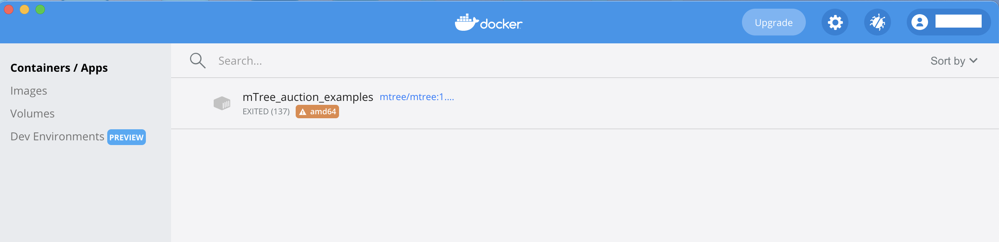
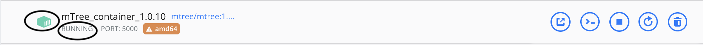

============
Installation
============
.. 
    is mTree a software or a python library ?

In order to run **mTree** we need to install `Docker Desktop <https://www.docker.com>`_  first.  

.. _install-docker-desk:

Installing Docker Desktop
-------------------------

The links for **Docker Desktop** installation for different **os** can be found below. 

    - `Download Docker Desktop <https://www.docker.com/products/docker-desktop>`_

.. tip:: 
        
        If you have a **Windows** machine and end up at the following prompt after installing **Docker Desktop** - 

        .. figure:: _static/installation_wls_kernel_update.png 

                WLS 2 Installation Incomplete 
        
        Visit the link and only complete **Step 4** from the webpage

                

After completing the **Docker Desktop** installation, we can start installing **mTree**

.. _install-mTree:

Installing mTree
----------------

You can install **mTree** by pasting the following code in your Command Prompt, PowerShell or Terminal.
However, make sure to check for the latest version of **mTree** `here <https://hub.docker.com/r/mtree/mtree/tags>`_,
in case the one below is out of date. 

.. code-block:: console

     docker pull mtree/mtree:1.0.11c

After pasting and running the command in your Command Prompt, your screen should look
like something like this 

.. figure:: _static/installation_mTree_docker_pull.png
        :align: center

        Your Command Prompt/Terminal/PowerShell after docker pull command

.. note:: 

    If you get an **ERROR** message in your **Command Prompt** try running the command after
    starting the **Docker Desktop** App and see if that helps. 
    
.. note::
        
    It is important that your **Command Prompt** is based in the same virtual environment where you
    have **Docker Desktop** installed in order for the docker pull command to work. 
    If you don't understand what this means, you don't have to worry about this. 

.. _mTree-container-setup:

mTree Container Setup
----------------------

.. tip:: 

        If you don't have an **mTree** simulation that is ready to run or you are new to **mTree**, visit
        the :doc:`quick_start` before you do this next step. 

Open **Docker Desktop** app on your computer and click
**Images** on the sidebar. 

.. figure:: _static/mTree_image.png
        :align: center

        **Images** Section on the **Docker Desktop** App

     
You should see the **mTree** image we just downloaded through docker hub in the previous step.
In the next step, we are going to run this image within a small virtualization of the **os** called a 
**container**. We can create our docker **container** by clicking **RUN** on the **mTree** image. 

After that you should see the following window. Follow all the steps, in the image below, before moving 
on to the next step. 

.. figure:: _static/mTree_container_setup.png
        :align: center

        **mTree** container setup

Once all the instructions in the above image are completed, you should click **Containers/Apps**
on the sidebar. After hitting **Containers/Apps**, you should see the following container -

        **Container/Apps** Section on the **Docker Desktop** App 

.. _mTree-container-options:

Container Options
^^^^^^^^^^^^^^^^^
Your container comes with several options that can be executed to change its 
state. 

.. _mTree-container-start:

Start
*****

Click ``START`` to start your container. 

.. figure:: _static/start_button.png
        :align: center

        **START** button 

A running docker container should have a green symbol on the left side. 

        A running docker container 

.. _mTree-container-stop:

Stop
****
You can stop running your container by pressing ``STOP`` button

.. figure:: _static/stop_button.png
        :align: center

        **STOP** button

.. _mTree-container-restart:

Restart
*******

You can restart your container by pressing the ``RESTART`` button 

.. figure:: _static/restart_button.png
        :align: center

        **RESTART** button 

.. _mTree-container-delete:

Delete
******
If you want to delete the image, you can press the ``DELETE`` button

.. figure:: _static/delete_button.png
        :align: center

        **DELETE** button

.. _mTree-container-cli:

Open Shell
**********

Once your container is running, you should click ``CLI`` button to open the **Command Prompt**/ **shell**
linked to your container. 

.. figure:: _static/shell_button.png
        :align: center

        **CLI** button

The **shell** produced by **Docker** should look similar to the following -

.. figure:: _static/container_command_prompt.png
        :align: center

        **docker shell**

