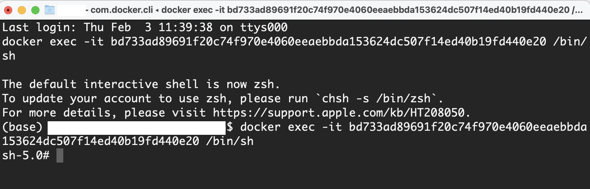

=================
Quickstart Guide
=================

.. _quickstart_guide:

Novice Path
===========

Do this step by step

1. :ref:`install-docker-desk`
2. :ref:`install-mTree`
3. :doc:`Get Started <start_here/quick_start>`
4. :ref:`cloning_mTree_auction_examples`
5. :ref:`running_mTree_auction_examples` 

   a. :ref:`mTree_auction_examples_container_setup`

      * :ref:`mTree-container-setup`

   b. :ref:`running_mTree_auction_examples_container`

      * :ref:`mTree-container-start`
      * :ref:`mTree-container-cli`

   c. :ref:`cva`
   d. :ref:`file_structure`
   e. :ref:`run_config`
   f. :ref:`finished_sim`
   g. :ref:`sim_results`
   h. :ref:`check_errors`
   i. :ref:`quitting`
   j. :ref:`conclusion`

Quickstart Guide
=================

In this **Quick Start Guide**, we are going to run a simple **mTree simulation**
while giving an overview of key components that are necessary for **mTree** to execute 
without error. The goal of this guide is to show you how to run an **mTree simulation** from 
start to finish and point out the vital indicators that convey a simulation has run properly. 

In order to complete this **Quick Start Guide**, you would need to the following installed on
your computer before you can begin 

1.  **Docker Desktop** - The quick start guide assumes that you have finished :ref:`install-docker-desk` 
2.  **Latest mTree Image** - This should be covered in the :ref:`install-mTree` section.
3.  **Git** - We are going to use **git** to run a simple **mTree simulation** later in this section. A simple way to check if you have **git** installed is to run :code:`git --version` in your Command Prompt/ Terminal/ PowerShell.
        * *Mac Users*  
             * If your Terminal says it doesn't recognize the command, which is very unlikely, visit the `Git Download for macOS <https://git-scm.com/download/mac>`_ website to download git. 
             * You'll have several options on how to install **git**, however, it is recommended to use **homebrew** route, check out this `git homebrew download video <https://www.youtube.com/watch?v=ZM3I16Z-lxI>`_ on how to do this. 
        * *Windows Users* 
             * If it doesn't recognize the command, suggesting you don't have git, visit the `Git Download for Windows <https://git-scm.com/download/win>`_ website and follow the directions highlighted in this `windows git download video <https://www.youtube.com/watch?v=4xqVv2lTo40>`_ .

4. **VSCode** - We recommend using an Integrated Development Environment (**IDE**) to edit and view **mTree** simulation code. Although, `VSCode <https://code.visualstudio.com>`_ is versatile and great, however, any **IDE** of your choice should also work.

.. _cloning_mTree_auction_examples:

Cloning mTree_auction_examples
==============================

We are going to clone the `mTree_auction_examples <https://github.com/nalinbhatt/mTree_auction_examples.git>`_ repository and run one 
of the examples to make sure **mTree** is running properly. 

Open your Command Prompt and navigate to an apporpriate place within your file system  
using the ``cd`` command and run the following code. If you have not used **Command Line** before 
you can check out the **tip** below or you could simply run the following code
and it will create an **mTree_auction_examples** folder in your **home directory** where the **Desktop** folder 
exists. 

.. code-block:: console

    git clone https://github.com/nalinbhatt/mTree_auction_examples.git

This will create an **mTree_auction_examples** folder at your specified 
location.

.. tip:: 
    If you are new to **command line** you can check out the following links on 
    how to navigate your file system -

    | `Terminal for Beginners <https://medium.com/@grace.m.nolan/terminal-for-beginners-e492ba10902a>`_ (Macs) 
    | `A Beginner's Guide to the Windows Command Prompt <https://www.makeuseof.com/tag/a-beginners-guide-to-the-windows-command-line/>`_ (Windows)

    Although, the following resources provide a great background which might be helpful later, nevertheless, 
    for these next few steps, you only need to know how the ``cd`` command works.  

.. _running_mTree_auction_examples:

Running mTree_auction_examples 
==============================

In order to run this simulation we need to create a **docker container** using 
the **Docker Desktop** app that we downloaded in  :doc:`installation` section. 

.. _mTree_auction_examples_container_setup:

mTree_auction_examples container setup
--------------------------------------

Follow all the steps highlighted in the :ref:`mTree-container-setup` section 
and set the **Host Path** to the **mTree_auction_example folder** (which you cloned in the previous step). 

* If you installed **mTree_auction_example** by navigating to somewhere in your file system, you are going to have to locate your folder in finder window by reviewing the steps you took. 
* If you did a simple **git clone** without ever using the ``cd`` command then you need navigate to your **home folder** (the folder which contains your Desktop) and select the **mTree_auction_examples** folder. 

After finishing the setup process, click **Container/Apps** on the sidebar of 
**Docker Desktop**. There should be a container by the name **mTree_auction_examples**
present. 

.. figure:: _static/mTree_auction_examples_comp_setup.png
        :align: center

        Your **Containers/Apps** section should display a container similar to this with the name you chose

.. _running_mTree_auction_examples_container:

Running mTree_auction_examples container
----------------------------------------

Start the container and open the **shell**. More details on how to do this are 
covered in :ref:`mTree-container-options` under :ref:`mTree-container-start`
and :ref:`mTree-container-cli`. 

Your **shell** should look some version of this - 

        mTree_auction_examples shell produced by clicking the CLI button

Run the following commands to view the underlying files in the folder.  

| **Mac** 

.. code-block:: console

    ls 

| **Windows**

.. code-block:: console

    dir

You should see the following subfolders-

.. figure:: _static/quick_start_ls.png
        :align: center

        Folders inside mTree_auction_examples

.. _cva:

Common Value Auction
--------------------

One of the subfolders present should have the name **common_value_auction**. Further information about the 
auction style and description can be found in the :ref:`common_value_auction` section of :doc:`learning_paths`.

In your **mTree_auction_examples** container **shell** type in the following command to set 
the current directory to **common_value_auction**.

.. code-block:: console
    
    cd common_value_auction

.. _file_structure:

File Structure
--------------

After setting **common_value_auction** as the current directory, run **ls** or **dir** and 
you should see the following folders. 

1. :ref:`config <config>`
2. :ref:`mes <Actors>`
3. :ref:`logs <logs>`

        Folders inside common_value_auction

.. note::
    In order to properly run an **mTree simulation** you need to set the current 
    directory to the folder which contains a **config**, **mes**, and a **logs** folder.
    **mTree** looks for these particular folders to run the simulation. For our example, this is the **common_value_auction**
    folder inside **mTree_auction_examples**.

.. tip:: 
    In the future, when designing your own container, you can set the **Host Path**
    directly to the folder containing the **config** and **mes** folder. That way 
    you don't have to navigate to the desired directory within the docker **shell**. 

The :ref:`config` folder (short for configurations) contains your **JSON config files** which are used to instantiate **mTree** :ref:`Actors <Actors>` defined in 
the **mes** folder. 

The **mes** folder (short for Microeconomic System) containes the python files where you define the different
:ref:`Actor <Actors>` classes, namely - the :ref:`environment` , :ref:`institution` and :ref:`agent`. 

.. warning:: 

    It is critical that your **simulation folder** contains a **config** folder, with a **JSON config file** inside,
    and a separate **mes** folder with python files inside, which contain :ref:`environment` , :ref:`institution` and :ref:`agent` code.
    **In the absence of any of these your mTree simulation will not run.**

Inside the **config** folder in the **common_value_auction** auction example, you should see a **basic_simulation.json** file. 
This is the config file which we will run. 

For the next step we want to make sure that our current directory is **common_value_auction** so if you used the **cd** command to 
change the directory to **config** and view its contents, we want to go up a directory using the following command to make sure 
we are in the right directory. 

.. code-block:: console 

    cd .. 

.. _run_config:

Running common_value_auction simulation
------------------------------------------

We can type the following command into the **shell** to start **mTree**.  

.. code-block:: console 

    mTree_runner 

You should see something similar to this.

.. figure:: _static/quick_start_mTree_runner.png
        :align: center

        mTree_runner window

Enter the following to start the selection process for the config file.

.. code-block:: console 

    run_simulation

Your window should look like this. 

.. figure:: _static/quick_start_run_simulation.png
        :align: center

        run_simulation window

Click **<enter>** to select and run the **basic_simulation.json** file. 
Your output should look something similar to this. 

.. figure:: _static/quick_start_run_config.png
        :align: center

        Running basic_simulation.json file 

.. _finished_sim:

How to know your simulation has finished running? 
-------------------------------------------------

mTree provides a ``check_status`` command that allows you to inquire the state of the simulation from the **shell** or **console**. 
Run the following command in your **shell** to see the state of the simulation. If you wish to know more about this command visit :ref:`sim_state` 
section. 

.. code-block:: console

    check_status

.. note:: 

    You can enter the ``check_status`` command multiple times to view the state of your simulation. 

Depending on the when you entered the ``check_status`` command, you should see any one of the following screens. 

.. figure:: _static/quick_start_check_status_running.png
    :align: center

    This indicates our simulation is still running 

    This indicates our simulation has finished running and we can move 
    to the next step and view our simulation results. 

Once we have identified that our simulation has finished we can move on to the next step which involves 

.. _sim_results:

Simulation Results
------------------

Ideally when a simulation is run, you should setup :ref:`Actors <Actors>` in such a way that 
they constantly :ref:`log <logs>`  their states to :ref:`.log <log_file>`  and  :ref:`.data <data_file>` files. 
This allows us to analyze how Actors behaved in our system, what decisions they made, and what effects those decisions had on the 
system as whole. 

logs
^^^^
The **logs** folder, inside your simulation folder (which in our case is **common_value_auction**), is where the 
output from your simulation gets stored. You should see a file ending in ``.log`` and a file ending in ``.data``. 

More on how these files are named can be found :ref:`here<log_file>`. 

.. note:: 
    In the figure below, we use `VSCode <https://code.visualstudio.com>`_ to open the generated **log files**. 
    However, no **IDE** is necessary to open these files and your notepad should also work. 
    That being said, we still advise using an **IDE**, like **VSCode**, to interact with an **mTree simulation**, 
    since they make viewing and editing files of different formats more intuitive. 

The first few lines of you ``.log`` file document the config file parameters which were used to run the simulation

.. figure:: _static/quick_start_log_config.png
        :align: center

        basic_simulation-2022_02_28-09_32_04_PM-R1-experiment.log

The rest of your ``.log`` file should look as follows. 

        basic_simulation-2022_02_28-09_32_04_PM-R1-experiment.log

Your ``.data``  file should look something like this - 

.. figure:: _static/quick_start_data_log.png
        :align: center

        basic_simulation-2022_02_28-09_32_04_PM-R1-experiment.data

.. note:: 

    Don't worry if the log files on your end don't match the ones shown here word for word. Since **mTree** is a 
    concurrent Agent-Based Modelling software, it is common for different :ref:`Actors <Actors>` to log asynchronously to the
    same ``.log`` and ``.data`` files, giving them an out of order look. 
    
.. _check_errors:

Checking for Errors
-------------------

You can use the ``ctrl F`` (Windows) or  ``cmd F`` (Mac) command to search for ``Error`` messages in the ``.log`` file. If there are no results then it is likely 
that your simulation has run properly. If there are instances of ``Error`` messages then check out the :ref:`error` section.

.. warning::

    If you see no results for ``Error`` but your mTree log stops logging in the middle of the simulation, then it is still 
    possible you have logic errors that don't terminate the process. Luckily, you don't have to worry about that in the 
    **common_value_auction** auction example.

.. _quitting:

Quitting
--------

Once the simulation has ended, you can run ``quit`` command in the **docker shell** to kill mTree. The ``quit`` command 
is used to kill all mTree processes as well as **delete** all :ref:`Actor <Actors>` instances previously created to run the simulation. 

.. code-block:: console 

    quit

Your console should look like some version of this - 

.. figure:: _static/quick_start_quitting_mTree.png
        :align: center

        Quitting **mTree**
        
.. _conclusion:

Conclusion
----------

.. TODO: Revise this conclusion to link to the new pages
Congratulations on successfully running your first mTree simulation! If you want to know how this example was built
or you want to find more projects like this, checkout :ref:`common_value_auction` or :doc:`learning_paths` sections. 
If you want to view a more in-depth case which builds an mTree project from scratch, checkout :doc:`quick_build`. 

